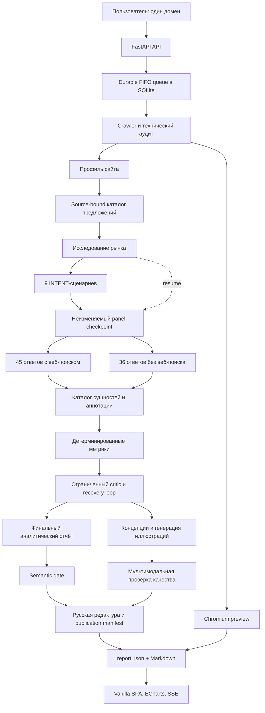

# AIV — руководство для разработчиков

AIV — публичный сервис RW+ для экспресс-исследования доступности сайта и бренда в ИИ-поиске. Пользователь указывает один домен, после чего сервис:

1. проверяет, какой HTML и какие правила сайт отдаёт поисковым и ИИ-краулерам;
2. определяет бренд и подтверждает продукты или услуги точными фрагментами
   сохранённых страниц;
3. исследует аудиторию, рынок и реальные задачи выбора;
4. моделирует девять пользовательских сценариев;
5. получает ответы пяти семейств ИИ-систем с веб-поиском и четырёх семейств без него;
6. детерминированно считает метрики по сохранённым ответам;
7. пропускает расчёты и текст через ограниченные циклы критики;
8. публикует интерактивный отчёт, реальные данные и иллюстрации.

Этот документ рассчитан на разработчиков, которые будут ревьювить код, искать узкие места, менять методологию, ускорять пайплайн и поддерживать production. Он описывает текущую реализацию, а не желаемую архитектуру.

> **Главные инварианты проекта**
>
> - Сырые ответы модельной панели — исходные доказательства. Завершённый непустой ответ нельзя незаметно переписать.
> - Метрики считает код, а не финальная LLM.
> - `unknown` и `unavailable` не превращаются в ноль и не попадают в знаменатель.
> - Режим «с вебом» или «без веба» учитывается только после проверки фактической транспортной телеметрии.
> - Продукт или услуга клиента входит в сценарии только с буквальным source receipt; общая рыночная тема не считается предложением бренда.
> - Корпус технического аудита ограничен 6–8 страницами, максимум 10. Длина содержательных страниц и raw-ответов локально не ограничена.
> - Повторный анализ существующей проверки не должен повторно собирать исходные ответы панели.
> - Историческая проверка использует сетку provider/mode/model из собственного
>   неизменяемого receipt, а не из сегодняшней конфигурации панели.
> - Публичный отчёт не должен публиковаться, если критик, provenance-проверка или semantic gate нашли неустранённое противоречие.

## Содержание

- [Быстрый запуск](#быстрый-запуск)
- [Архитектура](#архитектура)
- [Как проходит одна проверка](#как-проходит-одна-проверка)
- [Модельная панель и математика 81 ответа](#модельная-панель-и-математика-81-ответа)
- [Long-response harness](#long-response-harness)
- [Как считаются метрики](#как-считаются-метрики)
- [Хранение данных и checkpoints](#хранение-данных-и-checkpoints)
- [Очередь, восстановление и SSE](#очередь-восстановление-и-sse)
- [API](#api)
- [Фронтенд](#фронтенд)
- [Конфигурация](#конфигурация)
- [Тестирование](#тестирование)
- [Пересчёт сохранённых проверок](#пересчёт-сохранённых-проверок)
- [Production и безопасный деплой](#production-и-безопасный-деплой)
- [Как безопасно развивать проект](#как-безопасно-развивать-проект)
- [Безопасность](#безопасность)
- [Известные ограничения](#известные-ограничения)
- [Термины](#термины)

## Быстрый запуск

Требования:

- Python 3.12 или новее;
- [`uv`](https://docs.astral.sh/uv/);
- Node.js для двух frontend runtime test fixtures;
- ключ OpenRouter для реального аналитического запуска;
- Chromium для локального захвата первого экрана сайта.

Из корня проекта:

```bash
uv sync
cp .env.example .env
uv run playwright install chromium
uv run uvicorn app.main:app --host 0.0.0.0 --port 8000
```

В `.env` нужно как минимум заполнить:

```dotenv
OPENROUTER_API_KEY=...
```

Интерфейс откроется на `http://localhost:8000`. Проверка состояния:

```bash
curl -fsS http://127.0.0.1:8000/api/healthz
```

Приложение следует запускать именно из корня репозитория: `.env` читается относительно текущей рабочей директории. SQLite всегда находится по пути `<project>/sqlite.db`.

> **Осторожно с production-копией БД.** Запуск приложения вызывает `init_db()`: создаёт недостающие таблицы и колонки, чинит некоторые состояния очереди и может перевести незавершённые проверки в восстановление. Обычный импорт и старт приложения на копии production DB нельзя считать строго read-only операцией.

## Архитектура



### Технологический стек

- **Backend:** FastAPI, Uvicorn, Python 3.12+.
- **Хранилище:** SQLAlchemy 2 async, SQLite, `aiosqlite`.
- **Сетевой аудит:** `httpx`, Beautiful Soup, собственные SSRF- и redirect-проверки.
- **Скриншот:** Playwright/Chromium, в production — изолированный systemd worker.
- **LLM и изображения:** OpenRouter.
- **Frontend:** один server-rendered shell с vanilla HTML/CSS/JavaScript, без обязательной сборки.
- **Графики:** ECharts с SVG renderer.
- **Анимация:** GSAP.
- **Markdown:** локальная копия Marked.
- **Live progress:** Server-Sent Events через `StreamingResponse`.

### Карта репозитория

```text
app/
├── config.py                  переменные окружения и значения по умолчанию
├── db.py                      engine, SQLite pragmas, bootstrap-миграции
├── main.py                    ASGI app и lifespan
├── models.py                  SQLAlchemy-модели
├── schemas.py                 публичные Pydantic-контракты
├── routes/
│   ├── pages.py               SPA-маршруты и UI build id
│   ├── runs.py                создание, история, retry, share и SSE
│   └── shared.py              получение отчёта по share token
└── services/
    ├── crawler.py             discovery, probes, технический аудит
    ├── content_extractor.py   извлечение текста и признаков рендеринга
    ├── protections.py         WAF, captcha, auth, geo и shell detection
    ├── robots_parser.py       разбор robots.txt
    ├── proxy_pool.py          необязательный Webshare proxy pool
    ├── site_preview*.py       Chromium preview и worker
    ├── analyzer.py            основной аналитический пайплайн
    ├── offer_catalog.py       source-bound каталог и admission
    ├── long_response.py       lossless units, manifests и режимы длинных данных
    ├── claim_ledger.py        точный учёт JSON-claims и их coverage
    ├── fact_binding.py        неизменяемая привязка фактов к источникам
    ├── sharded_document.py    планы, receipts и сборка составных документов
    ├── sharded_artifact_store.py durable CAS-хранилище document shards
    ├── structured_audit_store.py durable audit и resume для continuable JSON
    ├── openrouter.py          OpenRouter transport и web attestation
    ├── analysis_critic.py     критик сущностей и расчётов
    ├── recovery_orchestrator.py bounded Fable recovery planner
    ├── report_editor.py       lossless редактура и защита фактов
    ├── live_russian_policy.py versioned policy snapshot и linter
    ├── report_semantic_gate.py semantic gate финального текста
    ├── run_coordinator.py     durable FIFO queue и lease
    ├── run_lease.py           защита от записи устаревшим worker
    ├── progress.py            стадии и terminal transitions
    └── event_bus.py           недолговечный SSE pub/sub

static/
├── index.html                 весь SPA: разметка, стили, state и renderer
├── brand/                     логотипы и версионируемые UI-ассеты
├── generated/<run-id>/        runtime preview и иллюстрации отчётов
└── vendor/                    локальные browser-зависимости

scripts/                       операторские rebuild и preview-команды
tests/                         unittest и adversarial regression tests
docs/                          продуктовые и дизайн-заметки
```

Основная сложность сосредоточена в [`app/services/analyzer.py`](app/services/analyzer.py). Это намеренно единый оркестратор, но при дальнейшем росте его стоит делить по границам домена: site intelligence, panel collection, entity resolution, metrics, report synthesis и visuals.

## Как проходит одна проверка

### 1. Создание и постановка в очередь

`POST /api/runs` принимает только `{"domain": "example.com"}`. Любые скрытые настройки краулера или моделей отклоняются Pydantic-схемой.

`normalize_domain()`:

- принимает домен или обычный HTTP(S)-URL;
- приводит hostname к нормальной форме;
- отбрасывает некорректные значения;
- перед сетевым запросом требует публичный DNS/IP;
- запрещает credentials в URL и порты, кроме 80/443.

Если для того же домена уже есть активная проверка, API возвращает её `run_id`, а не создаёт дубликат. Новая запись получает статус `pending` и попадает в общую FIFO-очередь. По умолчанию в ожидании допускается не более 20 проверок.

### 2. Discovery и технический аудит

Координатор резервирует единственный глобальный execution slot и вызывает `run_crawl()`.

Crawler:

1. читает главную страницу с контрольным браузерным user-agent до фактического
   конца ответа; после 4 МБ поток переносится из памяти во временный файл, но
   не обрезается;
2. извлекает из полного HTML не только URL, но и source evidence ссылки:
   `anchor_text`, `title` и ближайший содержательный `primary_snippet`; читает
   все глобальные `Sitemap:` из `robots.txt` и рекурсивно обходит
   `sitemapindex` без потолка числа `loc`;
3. если главная страница распознана как `client_rendered_shell`, всегда запускает
   isolated worker `aiv-site-preview-worker-v2` в режиме `navigation`, даже
   когда server HTML уже содержит восемь и больше ссылок;
4. сохраняет content-addressed receipt каждого sitemap-документа; при
   продолжении повторно использует успешные receipts и перечитывает только
   временно недоступные или незавершённые документы;
5. детерминированно ранжирует кандидатов по URL и доказательствам коммерческой
   релевантности, затем выбирает 8 репрезентативных страниц; допустимый
   runtime scope ограничен диапазоном 6–10, а 10 остаётся жёстким максимумом;
6. сохраняет полный набор candidate evidence в отдельном artifact
   `page_candidate_relevance`, а в `site_page_manifest` версии
   `aiv-2026-08-26-site-page-manifest-v6` кладёт только компактную проекцию,
   точно связанную с полным receipt;
7. проверяет выбранные страницы с десятью идентичностями:
   - `GPTBot`;
   - `OAI-SearchBot`;
   - `ChatGPT-User`;
   - `ClaudeBot`;
   - `PerplexityBot`;
   - `Perplexity-User`;
   - `Googlebot-desktop`;
   - `Google-Agent-desktop`;
   - `DeepSeekBot`;
   - `Chrome-control`;
8. отдельно читает и разбирает `robots.txt`;
9. сохраняет HTTP status, TLS, redirects, latency, безопасную часть заголовков,
   признаки защит, доступный текст и признаки рендеринга.

Коммерческий выбор использует policy `aiv-commercial-relevance-v1` и receipt
`aiv-commercial-relevance-receipt-v1`. Полные тексты навигационных
доказательств не попадают в компактный page manifest. Admission заново сверяет
их content-addressed artifact с выбранными страницами и технической матрицей.

Только полный, неусечённый navigation receipt протокола v2 подтверждает полное
rendered discovery. Старый worker, ошибка, тайм-аут или ограниченный результат
не выдаются за полный обход: manifest получает `discovery_state=terminal_partial`
и `coverage_state=bounded`. Если пригодных страниц меньше шести, анализ не
начинается на искусственно дополненном корпусе.

`DeepSeekBot` здесь — диагностический observed token. Он не доказывает поведение официального production crawler DeepSeek.

`content_extractor.py` различает:

- статический или server-rendered HTML;
- hybrid rendering;
- пустую CSR-оболочку;
- содержательную страницу с формой входа;
- Schema.org-типы и полноту извлечения.

Если транспорт оборвался до EOF, ответ не становится терминальным cache hit:
его зависимые признаки остаются `unknown`, а следующий continuation повторяет
запрос. Защиты Cloudflare, Qrator, DDoS-Guard, Variti, Akamai, Imperva,
DataDome, captcha, geo-wall и auth-wall классифицируются отдельно по всему
полученному документу.

Запуски сетевых запросов к одному домену разделены минимум 0,65 секунды. `DEFAULT_CONCURRENCY` ограничивает внутреннюю параллельность, но не отменяет per-domain rate limit.

### 3. Реальный первый экран сайта

Параллельно с техническими probes запускается `capture_site_preview()`:

- viewport: 1440×900;
- результат: `static/generated/<run-id>/site-preview-<hash>.jpg`;
- запись на диск атомарная;
- метаданные сохраняются как artifact `site_preview`;
- каждый URL и redirect повторно проверяется на выход в приватную сеть;
- ошибка preview не прерывает исследование.

Скриншот нужен только как визуальный контекст hero-блока отчёта. Он не влияет на технический score. Если preview недоступен, UI использует `static/brand/generated/aiv-report-cover.webp`.

### 4. Техническая и смысловая основа

`_prepare_analysis_foundation()` выполняет независимую работу параллельно:

- `_technical_summary()` и `_site_context()`;
- после этого `_review_technical_summary()` и `_classify_site()`.

Технические числа остаются программными. LLM-ревьюер только объясняет их и проверяет, что вывод не смешивает robots, WAF, CSR, auth и неизвестность.

Профиль сайта содержит подтверждённые:

- основной бренд и алиасы;
- тип сайта и категорию;
- продукты и услуги;
- аудитории и customer jobs;
- критерии выбора;
- рынок, географию и позиционирование;
- связи между сущностями и уровень уверенности.

#### Доказуемый каталог продуктов и услуг

До исследования рынка и генерации INTENT-сценариев `_bind_offer_catalog()`
строит отдельный source-bound каталог предложений клиента. Его источники —
точные `SourceUnit` сохранённых страниц: для каждого блока фиксируются URL,
идентификатор, полный текст и SHA-256. Кандидат попадает в каталог только тогда,
когда код может связать его с буквальным фрагментом конкретного source unit и с
явной ролью клиента как владельца или поставщика. Общая тематика страницы,
например SEO, programmatic или DOOH, сама по себе продуктом клиента не считается.

Этап сохраняет три независимых доказательства:

- `offer_candidate_normalization_audit` — разбор кандидатов и исходных цитат;
- `offer_catalog` — не более десяти подтверждённых продуктов, услуг или
  направлений вместе с dispositions и source manifest digest;
- `offer_catalog_admission` — code-owned решение о том, можно ли переходить к
  market research и сценариям.

Ограничение в десять предложений задаёт глубину продукта, но не ограничивает
длину страниц, цитат или ответов моделей. Пустой каталог не превращается в
универсальные общие сценарии. Он допускается только для явно некоммерческого
сайта или сайта без публичного предложения, если профиль имеет confidence
`medium` или `high`, в сохранённом source unit найдена точная цитата после
нормализации пробелов, source manifest совпадает и нет коммерческих сигналов.
Во всех остальных случаях `OfferCatalogAdmissionError` останавливает слой
fail-closed. Сохранённые технические данные остаются целыми, но неподтверждённый
каталог не маскируется убедительным отчётом.

Дальше `prompt_foundation` связывает digest профиля, каталога и market research
с шестью безбрендовыми INTENT-сценариями. Каждый принятый offer cluster должен
попасть хотя бы в один сценарий либо получить явное проверяемое исключение.

### 5. Исследование рынка до генерации сценариев

`_market_research()` обращается к сильной аналитической модели с обязательным веб-поиском. В контекст входят указанный пользователем сайт, извлечённые страницы и профиль.

Модель должна разделить:

- `site_confirmed` — факты, подтверждённые сайтом;
- `external_market_research` — рынок, аудитории, customer jobs, критерии выбора и терминологию из внешних источников.

Gate требует подтверждённый web transport, URL-citations, достаточное покрытие измерений и как минимум два независимых внешних источника. Внешний поиск не может переопределить основной бренд, если это противоречит сайту.

### 6. Девять пользовательских сценариев

`_generate_prompt_set()` создаёт ровно девять запросов:

- шесть безбрендовых discovery-запросов — по одному на каждый класс INTENT;
- три брендовых diagnostic-запроса.

Канонические INTENT-классы:

| Код | Смысл |
|---|---|
| `I` | Information Seeking — понять тему и получить общие сведения |
| `E` | Evaluative — сравнить варианты и критерии |
| `T` | Transactional — выбрать, заказать или принять решение |
| `NB` | Need Based — решить задачу, боль или ограничение |
| `NAV` | Navigation — найти источник, площадку или точку входа |
| `TR` | Trend-Driven — разобраться в тренде или меняющемся поведении |

Безбрендовый запрос не должен содержать бренд или его алиас и обязан просить назвать конкретные варианты. Брендовый запрос, наоборот, должен содержать подтверждённое имя.

Отдельный критик проверяет доминирующий INTENT и связь каждого сценария с market research. При несовпадении разрешена одна ограниченная переработка набора; бесконечного loop нет.

### 7. Сбор ответов модельной панели

После сохранения сценариев `_run_panel()` сначала собирает web-срез, затем memory-срез. Каждая ячейка хранит:

- точный сценарий и его роль;
- provider family и фактическую модель;
- запрошенный режим;
- raw response;
- citations и response annotations;
- usage;
- request hash;
- web-policy hash;
- результат transport attestation;
- status или provider error.

`_ensure_answer_rows()` не перезаписывает завершённый непустой raw answer.

Как только для проверки появилась хотя бы одна строка `ModelAnswer`, набор
сценариев становится неизменяемым panel checkpoint. При продолжении сервис до
нового market research или prompt generation сверяет:

- завершённый artifact `prompt_set` поддерживаемой legacy или canonical версии;
- ровно девять строк `VisibilityPrompt`, их порядок и полную идентичность artifact;
- принадлежность существующих ячеек панели этим сценариям, допустимые mode/status
  и наличие raw text у завершённых ответов.

Валидный checkpoint повторно использует те же девять строк сценариев и запускает
только незавершённые или неуспешные ячейки. Market research, генерация,
семантическое ревью и `_persist_prompts()` при resume не выполняются. Любое
расхождение останавливает продолжение fail-closed; raw answers и аннотации не
изменяются. Пока ответов панели нет, действует обычный путь создания и
сохранения сценариев. Для переанализа уже собранного корпуса остаётся отдельный
saved-answer reprocess, который также не запускает панель повторно.

Web-режим предлагает модели серверный OpenRouter web tool, а Perplexity — native Sonar search. Memory-режим явно выключает web plugin и запрещает tool calls. Одна только надпись `mode="memory"` ничего не доказывает: ответ войдёт в метрики только после проверки телеметрии.

Приложение не задаёт web tool собственные `max_results`,
`max_total_results`, `max_uses`, `search_context_size` или `max_tool_calls`:
это были скрытые локальные потолки полноты исследования. Физические ограничения
поискового endpoint всё равно остаются на стороне провайдера, поэтому каждый
retrieval shard имеет самостоятельную аттестацию, citations, полноту и audit;
неизвестный хвост никогда не превращается в доказанное отсутствие.
У всего progressing retrieval tree нет общего шестичасового или иного
wall-clock дедлайна: объёмное содержательное исследование не обрывается из-за
суммарной длительности. Liveness контролируется на уровне каждого POST через
transport inactivity/cancellation, а оплаченный результат сразу получает
durable receipt. При рестарте дерево продолжается без повторного биллинга;
циклы и отсутствие прогресса отсекаются точной идентичностью task, конечными
заранее объявленными facet и SHA-цепочкой предков.

Инструмент именно **предлагается**, а не навязывается через `tool_choice: "required"`. Принудительный `tool_choice` действует на каждом витке серверного цикла инструментов, поэтому модель не получает хода на текст: Anthropic закрывает обмен с `native_finish_reason="pause_turn"` и пустым `content`. Именно это с 1 по 21 августа 2026 валило каждый прогон на шаге `market_research`. Гарантию даёт не запрос, а `attest_web_response()`: она сверяет `usage.server_tool_use_details.web_search_requests` и `url_citation`-аннотации уже по ответу, а при нарушении контракта `chat()` повторяет запрос, явно сообщив модели причину отказа.

Отдельная тонкость: наличие `url_citation` зависит от upstream-эндпоинта, а не от модели. Замер 2026-08-21 на `anthropic/claude-opus-5` с закреплением провайдера: Anthropic и Claude Platform on AWS — 0 аннотаций при `web_search_requests=3`, Amazon Bedrock и Azure — 11–12 аннотаций. Настройки `reasoning` на это не влияют. Поэтому `chat()` запоминает по модели эндпоинты, которые выполнили поиск, но не отдали цитат, и обходит их через `provider.ignore`. Память живёт в процессе и сбрасывается рестартом; маршрутизация намеренно не входит в policy hash.

### 8. Каталог сущностей и аннотация ответов

Из полного сохранённого корпуса строится entity catalog. Он отделяет:

- основной бренд;
- подтверждённые продукты и направления клиента;
- связанные бренды группы;
- конкурентов и внешние альтернативы;
- общие отраслевые термины.

Повторяемая атомарная разметка выполняется processing-моделью. Затем код сверяет её с raw text и entity policy. Общие слова вроде «programmatic» или «DOOH» не становятся продуктами клиента только потому, что встретились в ответе. Для портфельной видимости нужна конкретная сущность клиента либо явная связь услуги с клиентом.

Аннотация привязана к:

- SHA-256 исходного ответа;
- фактической модели ответа;
- SHA-256 входного каталога и правил;
- версии annotation prompt.

Несовпавшая или устаревшая аннотация не используется.

Текущая версия разметки — `annotations-v19`. Перед разметкой каждый полный
raw-ответ делится кодом на lossless units. Каждый unit обрабатывается отдельно,
а ответ сохраняется только после того, как вернулись все ожидаемые unit id и
детерминированный reducer собрал единую аннотацию. Окна одного batch ограничивают
размер provider-вызова, но не объём исходного ответа: хвост raw не отбрасывается.

Разметка также детерминированно распознаёт
непрерывную Markdown-карточку «владелец → дочерние поля», включая numbered/hash
heading и поля вроде «Профиль», «Локация» и «Особенности», но останавливает
область на следующем peer heading или владельце. Markdown structural context
поднял версию с v15 до v16, а переход на lossless partitioned input — до v17.
Версия v18 добавляет semantic overlap вокруг каждого непересекающегося core:
модель видит соседний заголовок, имя владельца и продолжение фразы, но код
засчитывает буквальный факт только тому core, с которым пересекается evidence.
Overlap поэтому не создаёт двойных упоминаний и не разрывает связь
«владелец → услуга» на механической границе окна.
Версия v19 дополнительно связывает конкретную сущность только с её собственной
canonical-группой `entity_attribution_aliases` из того же raw-ответа. Общие
алиасы владельца остаются контекстом, но не могут разрешить атрибуцию соседней
услуги или продукта.
При пересборке сохранённого run старые derived-аннотации переразмечаются, тогда
как panel/raw-ответы моделей не запрашиваются и не изменяются.

### 9. Детерминированные метрики и critic loop

`_compute_metrics()` считает проценты только по валидным строкам. После этого `_run_analysis_critic_loop()` получает сценарии, профиль, каталог, provenance, аннотации и рассчитанные метрики.

Критик может:

- выявить слишком широкую атрибуцию сущностей;
- сузить alias/entity policy;
- запросить повторную аннотацию и пересчёт.

Критик не может переписать raw answers или вручную назначить проценты. Максимум — два раунда. Первый `revise` запускает ограниченную корректировку; повторное возражение или `block` останавливает публикацию. Terminal block связан не только с текущими фактами, но и с точной версией critic/model/map-reduce/recovery policy и digest ожидаемой сетки панели. Поэтому тот же execution scope не зацикливается, а осознанное обновление критика или контракта получает одну новую ограниченную попытку.

Первичный контекст критика содержит полный индекс корпуса с SHA, provenance,
разметкой и lossless manifest каждого raw-ответа. Прежняя выборка максимум из
24 ответов / 120 тысяч символов удалена: ни одна строка не исчезает из проверки.
Малый корпус проверяется одним вызовом. Большой проходит code-owned map/reduce:
ответы пакуются целиком, а одиночный ответ больше физического окна делится на
непересекающиеся core-фрагменты с semantic overlap. Fragment verdict сначала
сводится в verdict ответа, затем все ответы — в verdict корпуса. На каждом
уровне SHA/offset lineage обязан покрыть все core ровно один раз; missing,
duplicate или reordered unit закрывает gate. Кодовый verdict floor не позволяет
редьюсеру понизить `block`/`revise` или потерять critical/important finding и
policy adjustment. Все child POST, raw-выходы, usage и manifests остаются в
audit provenance.

Critic и его targeted-repair попытка используют model-max output envelope;
repair получает digest полного payload, каталог, метрики, индекс корпуса и
полный raw затронутых ответов. `finish_reason=length`, неполный или
schema-invalid verdict не становится готовым решением. После неудачного repair
действует консервативный deterministic fallback.

Рабочее окно critic рассчитывается по фактически сериализованному запросу:
из заявленного context window вычитается только физический output-reserve
модели. Дополнительного фиксированного запаса на 8 192 токена нет. Для входа
действует консервативная оценка «один UTF-8 byte = один token», поэтому второй
непрозрачный резерв лишь сокращал полезный контекст, не добавляя отдельной
гарантии безопасности.

#### Ограниченное восстановление после второго critic round

Если опциональный Fable-orchestrator включён и второй обычный critic вернул именно `revise`, допускается одна узкая попытка восстановления:

1. Fable получает факты, raw и аннотации только строк, которые critic указал в валидированных `policy_adjustments` или critical/important anomalies. Он выбирает allowlisted `answer_id` и даёт guidance, но не меняет raw, каталог или метрики.
2. Обычная processing-модель один раз переразмечает только выбранные ответы. Исполнитель требует полный raw без усечения, точный набор acceptance checks и сохраняет весь batch атомарно: lease, model, raw SHA и digest прежней аннотации должны остаться неизменными.
3. Метрики пересчитываются детерминированно из нового набора аннотаций. SHA исходного корпуса до и после обязан совпасть.
4. Отдельный Gemini round 3 заново проверяет результат. Полный raw каждого repaired `answer_id` включается в полный raw-корпус как mandatory evidence; если он отсутствует или не совпадает с manifest и provenance, gate закрывается. Публикация разрешена только по полному schema-valid `pass` первичного ответа; targeted/semantic repair, deterministic fallback и повышение `revise`/`block` до `pass` запрещены. Оборванный или неразбираемый round 3 всегда закрывает gate.

Для stage `analysis_critic` разрешены максимум один физический Fable POST, одно исполнение ремонта и один финальный critic call. Эти бюджеты и план хранятся в `recovery_epochs`, поэтому рестарт не открывает новую попытку. Targeted-аннотация содержит отдельный audit provenance и атомарный checkpoint контекста recovery, но остаётся актуальной при обычном resume, пока неизменны raw/model и базовый контекст. После рестарта post-repair state не возвращается к обычным round 1/2: если r3 ещё не был зарезервирован, выполняется ровно один оставшийся final call; exact completed primary r3 и его gate переиспользуются без provider call; `running`, `failed` или несовпадающий r3 закрывает публикацию fail-closed. Успешный resume требует одновременно совпадающие plan/provenance/state digests, validated primary r3 artifact и gate — один gate не считается authority. Если финальный gate не пройден, terminal block связывается с digest фактического post-repair состояния: следующий worker останавливается до round 1 и не расходует новые токены. Любая потеря lease или CAS-конфликт оставляет аннотации без частичной записи.

### 10. Финальный отчёт и визуальная ветка

После critic gate запускаются две независимые ветки через `asyncio.TaskGroup`:

1. финальный аналитический отчёт;
2. концепции и генерация иллюстраций.

Финальная модель не получает произвольный обрезанный dump. `_full_answer_context()`:

- строит manifest всего critic-approved корпуса;
- проверяет ожидаемые prompt × provider × mode cells;
- связывает manifest с provenance критика;
- включает все наблюдавшиеся строки, `omitted_count=0`;
- передаёт без посимвольного усечения полный текст всех transport-eligible строк;
- оставляет ineligible-строки в виде metadata-only;
- доказывает полное покрытие строк, units, JSON paths и evidence strata;
- fail-closed останавливается при несовпадении digest; старый настраиваемый
  input budget по умолчанию отключён, а фактический provider context window
  маршрутизируется через иерархический evidence-tree.

Структурный кандидат отчёта может получить одну repair-попытку. После этого
отдельный semantic gate проверяет causal claims, режимы, недоступные срезы,
числа и ограничения; для semantic repair предусмотрено не более двух итераций.
Когда исходный evidence-корпус не помещается в один физический запрос,
code-owned planner строит полную матрицу «утверждение отчёта × lossless
evidence shard». Каждая disposition обязана вернуть точные claim/shard IDs,
source path и подтверждаемую цитату. Ordered coverage manifest не допускает
пропуска, подмены или повторного учёта хвоста корпуса. Два schema-invalid или
неполных protocol rounds завершаются fail-closed; найденное в последнем shard
материальное противоречие поднимает итоговый verdict как минимум до `revise`.

Визуальная ветка:

- получает те же вычисленные факты и релевантный контекст клиента;
- создаёт три самостоятельные концепции;
- генерирует изображения через image model;
- проверяет каждое изображение мультимодальной processing-моделью;
- при проблемах усиливает prompt и повторяет генерацию;
- допускает не более трёх кандидатов на иллюстрацию;
- обрабатывает роли с ограниченной параллельностью 2.

Ошибка всей визуальной ветки не должна уничтожать корректный аналитический отчёт.

## Модельная панель и математика 81 ответа

Текущая конфигурация панели:

| Семейство | Web | Memory | Переменная модели |
|---|:---:|:---:|---|
| ChatGPT | да | да | `OPENROUTER_OPENAI_MODEL` |
| Gemini | да | да | `OPENROUTER_GEMINI_MODEL` |
| Perplexity | да | нет | `OPENROUTER_PERPLEXITY_MODEL` |
| DeepSeek | да | да | `OPENROUTER_DEEPSEEK_MODEL` |
| Claude | да | да | `OPENROUTER_CLAUDE_MODEL` |

Для каждого нового запуска есть 9 сценариев:

```text
web:    9 × 5 = 45 ячеек
memory: 9 × 4 = 36 ячеек
итого:       = 81 ячейка
```

Perplexity не входит в memory-срез, потому что текущий поисковый продукт панели не даёт честного offline-режима.

81 — это размер ожидаемой матрицы, а не обещание 81 пригодного ответа. Провайдер может вернуть ошибку, пустой текст или ответ с нарушенной web policy. Порог 60% внутри `_run_panel()` — лишь ранняя операционная проверка. Перед публикацией full-corpus manifest требует все ожидаемые ячейки без пропусков и дублей, с завершённым непустым raw answer и актуальной аннотацией. Transport eligibility затем определяет, может ли строка войти в метрики и в полнотекстовый контекст; неподтверждённый новый режим не превращается в измерение.

Новая панель использует контракт `panel-v3`: одна ячейка — один атомарный ответ
одного provider turn. Перед вызовом transport запрашивает у OpenRouter
`top_provider.max_completion_tokens` для конкретной модели и использует этот
advertised envelope. Если model metadata временно недоступна, код не подставляет
самодельный числовой потолок: сохраняет состояние `provider_default_unresolved`
и оставляет физический output envelope провайдеру. Панель не продолжает и не
склеивает ответ вторым поколением, потому что это уже было бы другим
наблюдением.

Если провайдер завершил такой атомарный ответ по своему физическому лимиту,
непустой и прошедший web-attestation текст сохраняется целиком как
`provider_limited_prefix`. Это реальное, но явно ограниченное наблюдение, а не
полный ответ. Оно не маскируется под `complete`: состояние и причина ограничения
проходят в provenance и slice-level `evidence_state`, `data_state` и
`limitation_reason`. Такой prefix не входит в знаменатель метрик: отсутствие
сущности в неизвестном хвосте нельзя трактовать как отрицательное наблюдение.
Он может войти только в квалифицированный полнотекстовый контекст и служить
положительным буквальным доказательством того, что действительно присутствует
в сохранённом префиксе; срез и quality state при этом остаются `limited`.

Перед единственным provider POST ячейка атомарно получает короткий
`running:<generation>:<token>` claim, а в `run_artifacts` создаётся append-only
reservation. Поэтому параллельные worker не оплачивают одну ячейку дважды, а
поздний worker не может перезаписать новый результат. Audit artifact хранит raw,
request hash, выбранный output envelope, transport, citations, usage и ошибку.
При resume failed raw сначала переносится в неизменяемый audit artifact;
completed raw повторно не открывается.

Завершённые artifacts старого bounded-контракта `panel-v2` остаются совместимыми.
Они принимаются только после проверки старого request hash,
allowlist, web policy и attestation; raw не переписывается и
панель не вызывается заново. Этот compatibility path не является политикой для
новых ячеек. Неуспешная или незавершённая legacy-ячейка может быть собрана уже по
`panel-v3`, сохранив прежнюю попытку в аудите.

При добавлении или удалении семейства нужно одновременно изменить:

1. `app/config.py` и `.env.example`;
2. `panel_models()` в `app/services/openrouter.py`;
3. web/memory policy;
4. expected-cell manifest;
5. provider logo и frontend labels;
6. тесты матрицы, attestation, метрик и отчёта.

## Long-response harness

Long-response harness разделяет три разные задачи:
атомарное наблюдение, обработку длинного входа и сборку длинного
производного JSON-документа. Смешивать эти режимы нельзя: вторая
генерация может продолжить отчёт, но не может стать частью первичного
ответа модели или авторитетного вердикта.

Важно не смешивать два независимых scope-контракта:

- технический аудит ограничен 6–8 страницами, по умолчанию берёт 8 и никогда
  не превышает 10;
- длина содержательной страницы или raw-ответа модели локально не ограничена.

Числа 10, 16 000, 24 000 или 48 000 в коде описывают продуктовую глубину либо
размер одного рабочего shard. Они не разрешают отрезать хвост источника. Когда
данные не помещаются в физическое окно модели, harness создаёт больше units и
provider-вызовов, а manifests доказывают exact-once покрытие всего источника.

В production нет локальных output-потолков на 3 200 или 6 400 токенов,
а также production-ограничений по числу частей или минимальной длине
очередного фрагмента. Transport запрашивает объявленный моделью максимум;
если metadata недоступна, оставляет предел provider endpoint. Это убирает
самодельные лимиты AIV, но не отменяет физические context/output limits модели
и выбранного endpoint.

### Три используемых режима

**Atomic single turn.** Ответ панели и авторитетный verdict нельзя собирать из
нескольких генераций. Это относится к panel observation, финальному verdict
аналитического критика и semantic gate. Каждый из них — один provider turn.
`finish_reason`, native finish reason, выбранный envelope и полнота сохраняются
вместе с raw. Оборванный structured verdict не ремонтируется вторым
ответом модели и закрывает gate. Неструктурированный panel response можно
сохранить только как `provider_limited_prefix`: он не входит в знаменатель
негативных метрик, потому что неизвестный хвост мог содержать искомую
сущность.

**Partitioned processing.** Длинный текст сайта или raw-ответа разбивается на
любое необходимое число последовательных units. Для каждого исходного документа
manifest хранит:

- `document_id`, SHA-256, число символов и UTF-8 bytes всего источника;
- число units;
- индекс, точные character offsets, SHA-256 и размер каждого unit.

Разбиение не теряет и не дублирует символы: код сразу реконструирует units и
сверяет текст и digest с источником. Unit id задаёт код, а не модель. В пути
аннотаций reducer требует ровно полный набор ожидаемых id; пропуск, дубль, иной
порядок или ошибка хотя бы одного unit не превращаются в частичный успех.

Когда исходный материал не помещается в одно рабочее окно, site profile и
entity catalog используют ограниченный fan-in и иерархические reducers:
code-owned job list требует успешности всех leaf-вызовов, а каждый leaf
подаётся ровно в одну группу следующего уровня, пока дерево не сведено в
итоговый artifact. Аннотация raw-ответа объединяется
детерминированно только после готовности всех его units и затем проходит обычный
literal grounding и policy reconciliation. Manifests и версии harness входят в
artifacts, поэтому resume может проверить, что повторно использует тот же полный
источник.

Для site profile и entity catalog одного совпавшего SHA недостаточно. Каждый
непересекающийся core получает content-addressed claim и ровно один проверяемый
disposition: `grounded_fact` с буквальной цитатой внутри исходного core либо
`explicit_no_fact` с конкретной причиной. Пустой, общий, переставленный,
дублированный или подменённый disposition закрывает слой fail-closed. В
ancestor provider-view передаётся только fixed-size head с count/digests и
границами; исходные решения остаются в отдельных bounded leaves, поэтому ни
один reducer/root не превращается в O(N) singleton. Терминальный результат
детерминированно сверяется со всеми исходными leaves и сохраняет дословные
факты, включая самый последний core.

В final-input harness `claim-ledger-v1` разбивает core каждого source unit на
проверяемые claims с `claim_id`, JSON path, UTF-8 offset, точным excerpt и
SHA-256. Реестр сохраняется как отдельный content-addressed artifact; mapper и
каждый reducer обязаны перенести каждый `claim_id` ровно один раз вместе с
исходным excerpt digest. Coverage validator отклоняет пропуск, дубль, чужой id
или несовпадающий digest. Точные scalar values дополнительно проходят в
финальный payload через code-owned passthrough, без пересчёта моделью.

Это доказательство полного учёта исходных фрагментов, а не гарантия их верной
интерпретации. Смысловую часть по-прежнему проверяют schema, literal grounding,
entity policy, critic и semantic gate.

**Continuable derived document.** Производный narrative JSON не является новым
измерением, поэтому `aiv-structured-continuation-v2` может дописать его после
физического `finish_reason=length`. Каждый следующий POST получает весь принятый
к этому моменту JSON-префикс как assistant context. Модель обязана повторить
точный overlap и добавить только новые символы. Код отклоняет неверную границу,
дубль или отсутствие новых данных, но не вводит порог минимальной длины
корректного фрагмента.

Resume contract связывает документ с моделью, исходными messages, JSON Schema,
`document_id`, reasoning, temperature, overlap и версией протокола. Документ считается
готовым только после разбора всего собранного JSON и локальной проверки
по JSON Schema Draft 2020-12. Этот режим запрещён для panel answers, метрик
и вердиктов.

Это мост через output-предел нескольких provider turns внутри одного context
window, а не протокол документов произвольного размера. В каждый следующий
запрос одновременно входят исходные messages, весь уже принятый JSON-префикс и
место для нового output. Когда эта сумма исчерпывает физический input context
модели или endpoint, transport останавливается до POST и сохраняет точный
resumable checkpoint; уменьшать, пересказывать или выбрасывать старый префикс
ради формального успеха запрещено. Отсутствие локального лимита частей не
отменяет этот физический предел.

Для производных документов больше одного context window работает
`aiv-sharded-document-v1`: код заранее строит полный план независимо
schema-valid shards по смысловым разделам, вычисляет точный размер каждого
физического POST вместе с system prompt, schema, reasoning и web policy, а
затем пишет отдельный content-addressed receipt. CAS-цепочка связывает plan,
request, raw response, parsed shard, predecessor и merge contract. Resume
принимает уже оплаченный shard только после повторной проверки всей цепочки.
Сборщик не может молча потерять или переставить раздел: он требует ровно все
shard id и сверяет итоговый документ с его schema и code-owned fact bindings.
Именно этот путь используется как fallback финального отчёта, когда целый JSON
физически больше одного context window. Ответ панели, измерение, critic verdict
и итоговый semantic-gate verdict остаются атомарными: два независимых решения
нельзя склеивать в одно авторитетное решение.

Site profile, entity catalog, prompt generation, prompt review, annotation,
analysis critic, semantic gate и финальный автор используют такой же принцип
для длинного входа: direct path выбирается только после точного preflight всего
provider request, а не по приблизительному числу символов. Если запрос не
помещается, число lossless units растёт без общего потолка; верхний слой
получает проверяемый semantic root, точные scalar values и lineage каждого
исходного leaf.

### Durable audit и восстановление

`aiv-structured-audit-delta-v2` хранит отдельный неизменяемый receipt каждого
физического POST, принятые фрагменты и один текущий head. Растущий полный
префикс не дублируется в каждом audit-событии: store ссылается на предшественника
и восстанавливает его по sequence и SHA-цепочке. После рестарта resume допускается
только при точном совпадении identity и всей цепочки. Если provider POST уже
завершился, а worker упал до обновления head, сохранённый receipt может быть
проверен и принят без повторного платного запроса.

Любая ошибка overlap, sequence, digest, schema, transport или lease оставляет
видимый failed/partial checkpoint с точным принятым префиксом. Подменять его
«усечённым успехом» нельзя.

Критик и финальный автор получают полный наблюдавшийся корпус. Локальной
выборки «лучших примеров» и потолка в 12 ответов больше нет: все 81 строки
матрицы входят в code-owned manifest, а каждый доступный raw разбирается
lossless evidence-tree. Для unattested legacy-строки вместо скрытого текста
передаётся provenance-only запись `metadata_only`. Явно помеченный
`provider_limited_prefix` содержит весь текст, который физически вернул
провайдер, но используется только как положительное буквальное доказательство
и не входит в знаменатели метрик. Manifest финального контекста имеет
`omitted_count=0` и связывает каждую строку с проверенным critic-corpus digest.

Перед финальным автором работает адаптивный контекстный harness. Если полный
запрос помещается в физическое окно модели, автор получает исходный payload
целиком, а отдельный content-addressed receipt фиксирует каждую пару
«промпт — ответ» и её SHA-256. Если запрос не помещается, код раскладывает
каждое JSON-значение на восстанавливаемые claims и добавляет к ним проверенный
AI Visibility-контекст: модель, режим web или memory, INTENT, роль сценария,
упоминание бренда и продукта, рекомендацию, конкурентов, citations и состояние
unknown. Ни один reducer не может подтвердить claim общим пересказом: нужны
исходный hash, дословный фрагмент и точная связь с JSON Pointer. Поэтому
исключение полного текста из одного монолитного окна не исключает этот ответ
из анализа.

Финальный fallback больше не создаёт отдельный платный вызов и видимый раздел
для каждого атомарного факта. Code-owned planner собирает связанные claims и
facts в тематические domain capsules. Для ответа модели он по возможности
держит вместе полный пользовательский промпт, ответ, аннотацию и citations;
для таблиц и метрик объединяет строки одного раздела. Размер каждой капсулы
вычисляется по фактическому сериализованному provider request и минимально
необходимому schema-valid output. Фиксированного лимита строк, ответов, claims
или капсул нет: когда капсула не помещается, planner делит только её, сохраняет
все атомарные receipts и затем собирает результат детерминированно. Так
контрольный слой не растёт по схеме «один факт — один раздел», но покрытие
исходных данных остаётся exact-once.

Ветка визуальных концепций следует тому же правилу: она получает все
аттестованные ответы, а не первые восемь. Если payload не помещается в окно
concept model, он проходит тот же иерархический evidence-tree с точным lineage;
output концепций собирается structured-continuation harness и принимается
только после полной JSON Schema validation.

### Финальная редактура русского текста

После смысловой приёмки аналитики отдельный редакционный слой обрабатывает все
читательские строки итогового отчёта и технического аудита. Политика
`aiv-ru-editorial-policy-v4` и lossless harness
`aiv-report-editor-lossless-v6` переносят в исполняемые требования правила
`ru-text` и внутренней инструкции RW+ «Живой русский язык». Production не
читает файл из пользовательского Yandex Disk. Проверенная копия хранится в
`app/policies/live_russian_ru.v2026-07-29.md`, manifest version —
`live-russian-2026-07-29.1`. Модуль принимает snapshot только при SHA-256
`0cd7bbc6cdb006331b3df3c414cc0cdb9bc9860dfa2706b098fe610778392d84`.
Смена хотя бы одного байта без обновления версии и checksum закрывает
редакционный контракт.

Слой называет деятеля и носителя каждого числа, отделяет наблюдение от
интерпретации, убирает пассив, канцелярит, лозунги, механические тройки, длинное
тире, мета-повествование и фразы «капитана очевидность». Те же editor, critic и
bounded arbiter обрабатывают не только финальный narrative, но и техническое
ревью, заголовки, подписи и alt-тексты иллюстраций.

Редактор не имеет права менять числа, знаменатели, бренды, продукты, URL,
причинность, модальность, границы выборки или набор утверждений. Текст любой
длины делится на lossless units без общего потолка; каждый claim получает
receipt, независимый critic сравнивает исходную и новую формулировки, а спорный
unit проходит не более одной арбитражной правки. Пробелы и переносы на границе
units остаются под контролем кода: модель редактирует только внутренний текст,
а сборщик восстанавливает точные разделители и проверяет их по отдельным
receipts. Для финального отчёта вся
отредактированная версия повторно проходит полный semantic gate на исходных
данных. Если покрытие неполно, факт изменился или редакционный вызов недоступен,
публикуется уже проверенная исходная формулировка и сохраняется явный fallback
audit. Редактура никогда не блокирует готовый доказанный отчёт и не может
исправлять метрики словом.

Перед записью `analysis_markdown` и `report_json` запускается
`reader_copy_manifest` версии `aiv-reader-copy-manifest-v5`. Он связывает:

- SHA-256 отредактированного финального отчёта и точный Markdown, который из
  него отрендерен;
- публичный narrative в `report_json`;
- публичный snapshot расчётного отчёта;
- опубликованный набор иллюстраций и их подписи;
- редакционные receipts финального, технического и иллюстративного слоёв;
- manifest и SHA-256 канонической русской политики;
- версионированный code-owned registry всех интерфейсных и fallback-текстов;
- точные байты опубликованных bitmap-иллюстраций и site preview.

Browser загружает тот же `static/reader-copy-registry.ru.v2026-08-26.js` по
закреплённому SRI, который backend проверяет байт-в-байт и прогоняет через
русский lint. Поэтому текст, созданный кодом, не обходит финальную редакционную
политику. Manifest возвращает `pass`, `degraded_safe` или `block`. Недоступный редактор,
предупреждение линтера или безопасный fallback дают `degraded_safe`: готовая
аналитика не теряется. Несовпадение опубликованного Markdown/JSON, подмена
значения, policy digest или audit digest дают `block` до записи публичного
отчёта. Так слой качества улучшает формулировки, но не получает права менять
факты или скрывать повреждение publication contract.

### Structured responses

Для каждого нового structured response transport отправляет `response_format`
с `strict: true`, затем локально проверяет разобранный JSON через JSON Schema
Draft 2020-12. Успешный HTTP, JSON-подобный текст или внешний `strict` сами по
себе не делают artifact готовым. Output-limited, незавершённый, неразбираемый
или schema-invalid ответ не принимается и не публикуется как валидный объект.
Для производных документов, которые могут быть длиннее физического output-окна
одного provider turn, используется явно opt-in режим continuable. Его
output-limited prefix остаётся незавершённым audit artifact до полной
hash-chained сборки и повторной локальной проверки всего JSON. Это общий
transport-примитив для структурированных аналитических слоёв, а не особое
послабление только финальному отчёту.
Совместимый cached artifact сейчас проверяется своим version/input/model
контрактом и stage-specific validators; общей повторной Draft 2020-12 validation
при чтении старого cache нет.

### Что harness не отменяет

- У каждой модели и provider endpoint остаются физические context/output limits,
  timeout, rate limit и возможный incomplete finish. Harness делает их видимыми,
  но не может увеличить внешний предел. Если полный принятый префикс,
  исходные messages и schema больше не помещаются в физический context, операция
  завершается видимой ошибкой и оставляет точный checkpoint. Код не сжимает
  и не выбрасывает накопленный префикс, чтобы скрыть проблему.
- У continuable-операции нет общего wall-clock deadline и потолка числа частей.
  Пока новый provider turn даёт проверяемый прогресс, harness продолжает
  документ. Мёртвый или зависший сетевой вызов останавливает только inactivity
  timeout отдельного POST (по умолчанию 2 часа); точный partial checkpoint
  остаётся доступен для crash-safe resume без повторной оплаты принятых частей.
- Размер unit, reducer fan-in, batch size и concurrency ограничивают размер
  одного вызова и параллелизм. Они не задают потолок длины источника или числа
  документов в логическом корпусе.
- Crawler не задаёт потолок сетевого body: поток читается до EOF и после
  memory-spool threshold уходит на диск. Разрыв транспорта оставляет
  продолжимый incomplete receipt и `unknown`, а не «успешный префикс».
  Ограничено только число страниц, выбранных после полного discovery для
  дорогой матрицы user-agent probes; этот sampling scope явно отражается в
  coverage и не обрезает содержимое выбранной страницы.
- UI может показывать только несколько карточек, подписей или примеров. Это
  presentation window над сохранённым report JSON, а не удаление raw, annotation
  или metric evidence.
- Финальный автор и визуальный concept-layer не получают один физически
  безразмерный prompt. Они получают весь логический корпус через проверяемое
  дерево units: каждый leaf учтён, а модель верхнего уровня видит bounded
  evidence digest и code-owned точные scalar values. Это маршрутизация полного
  корпуса под реальные окна провайдера, а не обрезание источника.

Переанализ сохранённой проверки не требует повторно опрашивать модельную
панель. `scripts/reprocess_saved_run.py` перестраивает только downstream-слои.
Он снимает точный SHA-256 всех физических полей `model_answers`, а analyzer
повторно сверяет этот digest уже под SQLite writer lock внутри той же
транзакции, которая записывает publication receipt, новый report и terminal
status. После возврата CLI выполняет независимую третью сверку. Исходные panel
answers не запрашиваются заново и не переписываются.

## Как считаются метрики

### Базовые правила знаменателя

Строка входит в расчёт, только если:

- panel request завершён;
- raw text непустой;
- фактический режим подтверждён transport attestation;
- аннотация существует и совпадает с raw-answer/model/input hashes;
- аннотация помечена как валидная.

Отсутствующая, failed, stale или unattested строка не считается нулём — она исключается и отражается в `data_state`, coverage и limitations.

### Безбрендовая видимость

Для шести `unbranded_discovery` сценариев отдельно считаются:

- `mention_rate` — доля валидных ответов, где система сама назвала цель;
- `top3_rate` — доля валидных ответов, где цель вошла в первые три позиции;
- `recommendation_rate` — доля валидных ответов с прямой рекомендацией;
- `conditional_rate` — доля условных рекомендаций;
- `score` — составной индекс:

```text
score = 0,25 × mention_rate
      + 0,35 × top3_rate
      + 0,40 × recommendation_rate
```

Score — внутренний индекс видимости, а не вероятность, не market share и не процент пользователей.

### Parent brand и portfolio

`parent_discovery` отвечает на вопрос: назвали ли основной бренд без подсказки.

`portfolio_visibility` отвечает на вопрос: назвали ли подтверждённые продукты, направления или связанные бренды клиента. Здесь действует более строгая attribution policy. Само совпадение с тематикой запроса не считается продуктовой видимостью.

Если профиль не подтверждает состав портфеля, весь portfolio-срез становится `unavailable`, а не `0%`.

### Brand knowledge

`brand_knowledge` строится по трём `brand_diagnostic` сценариям, где бренд уже назван в вопросе. Этот срез нельзя смешивать с безбрендовым discovery: он измеряет качество ответа о названном бренде, а не способность самостоятельно его обнаружить.

### Технический score

Технический score — взвешенный индекс нескольких измеренных сигналов на проверенных страницах. Он не является «процентом доступа сайта» и не доказывает реальную индексацию конкретной ИИ-системой.

Скриншот Chromium не влияет на score. Основной технический источник — исходный server HTML и HTTP-поведение для разных user-agent identities.

### Evidence states

Актуальные строки могут иметь состояния:

- `attested` — режим подтверждён текущим контрактом;
- `legacy_retrieval_confirmed` — старый web-запуск с достаточным подтверждением;
- `legacy_observational` — исторический memory-срез без строгого доказательства запрета web;
- `mixed` — в одном aggregate смешаны разные классы доказательств;
- `unavailable` — пригодных данных нет.

Legacy observational данные можно показывать только с явным ограничением; их нельзя интерпретировать как чистый причинный эффект отключения веб-поиска.

## Хранение данных и checkpoints

### SQLite

База находится в `sqlite.db`. При соединении включаются:

```text
PRAGMA foreign_keys=ON
PRAGMA busy_timeout=10000
PRAGMA journal_mode=WAL
PRAGMA synchronous=NORMAL
```

Полноценной системы миграций вроде Alembic пока нет. `init_db()` вызывает `create_all()` и набор best-effort `ALTER TABLE`. Большинство ошибок добавления старых колонок проглатывается; наличие уникального execution-slot index проверяется строго.

Для следующего серьёзного изменения схемы рекомендуется сначала внедрить нормальные нумерованные миграции. До этого каждую новую колонку нужно добавить и в SQLAlchemy-модель, и в bootstrap-миграцию, и проверить на копии старой БД.

### Таблицы

| Таблица | Назначение |
|---|---|
| `runs` | Корень проверки: очередь, lease, progress, итоговый Markdown/JSON, share token |
| `domain_probes` | HTTP/TLS/redirect/header/body/protection facts по URL и user-agent |
| `robots_rules` | Разобранные правила `robots.txt` |
| `site_pages` | Репрезентативные страницы и извлечённый контент |
| `run_artifacts` | Versioned checkpoint/cache промежуточных этапов |
| `visibility_prompts` | Девять сценариев проверки |
| `model_answers` | Сырые ответы модельной панели |
| `answer_annotations` | Нормализованная разметка, 1:1 с ответом |
| `report_illustrations` | Метаданные, prompt, model и file URL иллюстраций |

Все дочерние таблицы связаны с `runs` через `ON DELETE CASCADE`.

### Источники истины

Иерархия данных:

1. `model_answers.response_text`, citations и transport provenance — исходное модельное доказательство;
2. `answer_annotations` — производная, пересчитываемая разметка;
3. artifact `metrics` — детерминированный расчёт из текущих аннотаций;
4. `report_json` и `analysis_markdown` — публичное представление;
5. frontend charts — визуализация `report_json`, а не самостоятельный расчёт.

Если UI показывает число, которого нет в `report_json`, это frontend bug. Если `report_json` расходится с artifact `metrics`, это pipeline bug. Финальная LLM не должна быть источником новых процентов.

### `run_artifacts`

Artifact — mutable checkpoint по уникальному ключу `(run_id, artifact_key)`, а не append-only журнал всех попыток.

Кэш считается пригодным только при совпадении:

- `status == completed`;
- `prompt_version`;
- `model`, когда модель имеет значение;
- полного `input_json`;
- непустого `output_json`.

Основные группы artifacts:

- page manifest, commercial-relevance receipt и site preview;
- site profile, source-bound offer catalog, admission и technical review;
- market research;
- prompt set и prompt semantic review;
- полный panel-corpus receipt с исторической provider/mode/model topology и
  отдельный coverage admission, связанный с digest этой сетки;
- entity catalog и annotation batches;
- metrics;
- critic rounds, policy и gate;
- full-corpus manifest, context selection и token preflight;
- final author candidate, semantic review, claim×evidence coverage и repair;
- illustration concepts, candidates, fresh/saved-asset QA;
- editorial receipts, code-owned copy registry, immutable reader manifest и
  content-addressed publication receipts.

Версии слоёв находятся в верхней части `app/services/analyzer.py`, а версии критиков — в соответствующих модулях. Если изменился смысл prompt, schema, deterministic policy или входной контракт, нужно увеличить именно версию затронутого слоя. Иначе старый artifact может быть ошибочно принят за актуальный.

## Очередь, восстановление и SSE

### Машина состояний

Фактический enum:

```text
pending → crawling → analyzing → completed
                              ↘ failed
```

`recovering` — не значение `RunStatus`, а `stage_key`. Публичный `run_state` вычисляется как `queued`, `running`, `recovering`, `completed` или `failed`.

Шесть публичных stage keys:

- `site_discovery`;
- `technical_access`;
- `scenario_design`;
- `web_visibility`;
- `knowledge_gap`;
- `report`.

### Почему одновременно работает одна проверка

`EXECUTION_SLOT = 1`, а partial unique index разрешает только одну строку с непустым `execution_slot`. Claim старейшей queued-проверки выполняется в `BEGIN IMMEDIATE`.

Это глобальное ограничение на runs. `DEFAULT_CONCURRENCY` и `OPENROUTER_PANEL_CONCURRENCY` задают параллельность внутри одной проверки, а не число одновременных клиентов.

### Lease и восстановление

Claim хранит `lease_owner`, `lease_expires_at`, `heartbeat_at`, `attempt_count`, `resume_count` и `state_revision`. Heartbeat продлевает lease примерно раз в `max(5, lease_seconds / 3)` секунд.

`run_lease.py` связывает дочерние задачи с владельцем через `ContextVar`. Owner-aware UPDATE и `assert_run_lease()` не дают старому worker записать checkpoint или финальный отчёт после потери слота.

После рестарта или истечения lease проверка:

- возвращается в `pending`;
- получает `stage_key="recovering"`;
- сохраняет уже готовые raw answers, probes и artifacts;
- продолжает с совпадающих checkpoints.

### SSE

`event_bus.py` — in-memory транспорт, а не durable log. Он хранит до 500 последних событий на run и очищает завершённые каналы позднее.

`GET /api/runs/{id}/events` всегда сначала отдаёт authoritative snapshot из SQLite. `Last-Event-ID` имеет вид `<resume_count>:<sequence>`, поэтому cursor старой попытки не переносится на новый retry. Keepalive отправляется каждые 15 секунд.

После рестарта полный event history теряется, но актуальное состояние не теряется: его восстанавливает SQLite snapshot.

## API

FastAPI OpenAPI и интерактивная документация отключены. Публичные маршруты:

| Метод | Путь | Назначение |
|---|---|---|
| `GET` | `/` | Главная SPA |
| `GET` | `/history` | Публичная общая история |
| `GET` | `/r/{token}` | SPA для share-ссылки |
| `GET` | `/api/ui-version` | Текущий UI build id |
| `GET` | `/api/healthz` | Минимальный liveness check |
| `POST` | `/api/runs` | Создать проверку по одному домену |
| `GET` | `/api/runs` | Лёгкая cursor-страница публичной истории, 100 строк по умолчанию, максимум 200 |
| `POST` | `/api/runs/lookup` | Получить до 8 переданных run IDs |
| `GET` | `/api/runs/{id}` | Progress или готовый публичный отчёт |
| `POST` | `/api/runs/{id}/retry` | Продолжить обычный pipeline |
| `POST` | `/api/runs/{id}/share` | Создать share token |
| `GET` | `/api/runs/{id}/events` | SSE progress stream |
| `GET` | `/api/shared/{token}` | Публичный report payload по token |

История полностью публичная и хранится на сервере. Она не привязана к `localStorage`, браузеру или авторизации. Share token — удобный стабильный URL, а не граница конфиденциальности.

Публичный `RunDetail` намеренно не включает:

- raw prompts;
- фактические model IDs;
- raw response bodies;
- proxy credentials или addresses;
- request headers;
- внутренние provider errors;
- служебные artifacts и critic payloads.

## Фронтенд

Весь клиент находится в [`static/index.html`](static/index.html). Сборщика и компонентного framework нет: один файл содержит HTML shell, CSS, state, маршрутизацию и render functions.

Клиентские экраны:

- `/` — форма новой проверки;
- `/?run=<uuid>` — progress или отчёт;
- `/history` — общая публичная история;
- `#history` — поддерживаемый legacy redirect;
- `/r/<token>` — shared report.

Поведение live run:

1. начальный `GET /api/runs/{id}`;
2. `EventSource('/api/runs/{id}/events')`;
3. резервный GET polling;
4. отклонение stale update по `state_revision`;
5. восстановление после смены `resume_count`.

История загружает первые 100 строк без тяжёлых `report_json` и
`analysis_markdown`; более ранние страницы открываются по стабильному cursor
`before_created_at + before_id`. Каждые 10 секунд UI запрашивает через
`/api/runs/lookup` только до восьми активных run IDs, а верхнюю страницу
перечитывает раз в минуту. UI build id также проверяется раз в минуту и при
возврате фокуса, чтобы открытая вкладка могла предложить обновление интерфейса.

Зависимости в браузере:

- Marked поставляется локально;
- GSAP и ECharts загружаются с jsDelivr с SRI;
- Manrope загружается из Google Fonts.

При отсутствии ECharts интерактивный график показывает контролируемое состояние ошибки, а числовые данные остаются доступны через табличный fallback. Графики используют SVG renderer, `ResizeObserver`, cleanup при rerender и учитывают `prefers-reduced-motion`.

Для старых `report_json` сохранена legacy-ветка renderer. При изменении schema нельзя просто удалить старые поля: сначала нужна миграция отчётов либо явная compatibility policy.

Брендовые ассеты и их происхождение описаны в [`static/brand/BRAND_NOTES.md`](static/brand/BRAND_NOTES.md). Источники provider marks — в [`static/brand/providers/THIRD_PARTY_ASSETS.md`](static/brand/providers/THIRD_PARTY_ASSETS.md).

Различайте:

- `static/brand/generated/` — версионируемые UI-ассеты, деплоятся с кодом;
- `static/generated/` — runtime-файлы конкретных проверок, не должны удаляться при code deploy.

## Конфигурация

Все настройки объявлены в [`app/config.py`](app/config.py), образец — [`.env.example`](.env.example).

### OpenRouter и модели

| Переменная | Значение по умолчанию | Роль |
|---|---|---|
| `OPENROUTER_API_KEY` | пусто | Обязательный секрет для реальных вызовов |
| `OPENROUTER_MODEL` | `anthropic/claude-opus-5` | Общий fallback |
| `OPENROUTER_ANALYSIS_MODEL` | `anthropic/claude-opus-5` | Сильная аналитика и финальный автор |
| `OPENROUTER_PROCESSING_MODEL` | `openai/gpt-5.6-terra` | Каталог, аннотации, QA; high reasoning задаёт код |
| `OPENROUTER_CRITIC_MODEL` | `google/gemini-3.6-flash` | Prompt critic, analysis critic, semantic gate |
| `OPENROUTER_ORCHESTRATOR_MODEL` | `anthropic/claude-fable-5` | Дорогой planner только для исключительного восстановления |
| `PIPELINE_ORCHESTRATOR_ENABLED` | `false` | Опционально разрешает bounded recovery после исчерпания обычного контура; включается явно после канарейки |
| `PIPELINE_ORCHESTRATOR_MAX_CALLS_PER_RUN` | `2` | Лимит логических recovery-эпох на одну проверку; в каждой эпохе Fable получает не более одного физического POST |
| `PIPELINE_ORCHESTRATOR_MAX_INPUT_CHARS` | `0` | Deprecated compatibility knob; `0` отключает старое посимвольное ограничение planner-контекста |
| `OPENROUTER_ILLUSTRATION_CONCEPT_MODEL` | `anthropic/claude-opus-5` | Art direction |
| `OPENROUTER_IMAGE_MODEL` | `google/gemini-3-pro-image` | Генерация изображений |
| `OPENROUTER_OPENAI_MODEL` | `openai/gpt-chat-latest` | ChatGPT family в панели |
| `OPENROUTER_GEMINI_MODEL` | `google/gemini-3.6-flash` | Gemini family в панели |
| `OPENROUTER_PERPLEXITY_MODEL` | `perplexity/sonar-pro-search` | Perplexity family в панели |
| `OPENROUTER_DEEPSEEK_MODEL` | `deepseek/deepseek-v4-pro` | DeepSeek family в панели |
| `OPENROUTER_CLAUDE_MODEL` | `anthropic/claude-sonnet-5` | Claude family в панели |
| `OPENROUTER_TIMEOUT_SECONDS` | `180` | Compatibility-настройка ожидания чужого panel claim |
| `OPENROUTER_READ_TIMEOUT_SECONDS` | `7200` | Inactivity deadline одного provider POST; не ограничивает размер документа, но освобождает lease при мёртвом сокете |
| `OPENROUTER_PANEL_CONCURRENCY` | `5` | Параллельность panel cells внутри run |
| `FINAL_INPUT_TOKEN_BUDGET` | `0` | Deprecated compatibility knob; значение учитывается только в диагностике и больше не может отклонить или обрезать input |

Настроек `OPENROUTER_STRUCTURED_MAX_CONTINUATIONS`, общего continuable deadline
и минимального размера части в production-конфигурации и transport API нет.
Остановить сборку могут только отсутствие доказанного прогресса, неверный
overlap/JSON/schema, физическое context window, inactivity/transport failure
или внешняя отмена. Ни один из этих исходов не принимает partial JSON как
готовый документ.

Модель и версия prompt сохраняются вместе с artifacts. Простая замена default model не должна молча переиспользовать результат другой модели.

Recovery-orchestrator не участвует в штатном happy path. После исчерпания
локальных repair-попыток он получает структурированный incident, факты, digest
и узкий allowlist действий. JSON-safe serializer больше не режет строки по
старому character budget; рекурсивная защита остаётся только от патологических
объектов.

Если весь incident помещается в физическое окно Fable, выполняется один direct
decision. Для большего входа код строит lossless JSON-leaf manifest с JSON
Pointer, UTF-8 offsets и SHA-256. Terra читает каждый exact core в любом числе
физически допустимых shards. Код требует exact-once coverage, проверяет digest
каждого unit, буквальную опору выводов и допустимую область answer/artifact ID,
затем собирает одно полное source-bound decision dossier. В досье входят
смысловые квитанции всех units, findings, uncertainties, manifest и неизменяемый
code-owned control plane; исходный raw и точные цитаты остаются в связанных
audit receipts. Fable получает ровно один физический POST с этим досье и не
может выбрать объект, которого нет в `executable_scope_evidence`.

Общего ограничения длины incident или числа Terra-shards нет. Если даже полное
семантическое досье не помещается в физическое окно Fable, сильная модель не
получает обрывок и не принимает частичное решение. Stage использует только
предусмотренный кодом узкий fallback либо сохраняет checkpoint и
останавливается. Так физический лимит провайдера не превращается в скрытую
потерю данных и одновременно не создаёт неограниченное число дорогих вызовов.

Каждый Terra map и Fable POST имеет content-addressed `RunArtifact` checkpoint.
Accepted provider response после падения worker восстанавливается по точному
wire contract без повторной оплаты. Planning epoch заранее сохраняет frozen
model-envelope snapshot; crash-replay работает только в cache-only режиме и не
делает metadata GET или provider POST. Если нужной квитанции нет, прерванная
эпоха помечается failed, а новая попытка подчиняется прежнему глобальному и
stage-бюджету. Несовпадение incident, scope, envelope или digest закрывает
recovery fail-closed.

Все receipts, coverage и runtime-счётчики сохраняются в
`usage_json._aiv_recovery_input_harness`; пропуск, перестановка или подмена leaf
закрывают recovery fail-closed. Модель не исполняет код, не меняет raw-ответы,
SQL или метрики. Решение проходит кодовую проверку области, сохраняется в
durable-журнале `recovery_epochs`, исполняется фиксированным обработчиком и
закрывается сравнением before/after digest. Одинаковое действие для того же
fingerprint второй раз запрещено. `acceptance_checks` — не свободный текст
модели, а точный набор исполняемых кодом проверок текущего stage. Потерявший
lease worker не может сохранить или завершить recovery epoch.

Контур используется в `scenario_design` после четырёх обычных итераций и опционально в `analysis_critic` после двух обычных раундов. В первом случае planner может назначить одну последнюю guided-попытку, проверенный детерминированный fallback или безопасную остановку с checkpoint. Во втором разрешён только scoped annotation repair либо stop; Fable не может обойти независимый Gemini gate или самостоятельно опубликовать ограниченный отчёт. Неизменность raw-корпуса и финальный critic verdict обязательны.

`chat()` сохраняет в `usage_json._aiv_transport` HTTP-статус, попытку, провайдера, фактическую модель, `finish_reason`, `native_finish_reason` и признак полноты output, а в `_aiv_output_envelope` — выбранную политику, advertised maximum или `provider_default_unresolved`. Это только transport evidence: успешный HTTP-ответ или `finish_reason=stop` не означает, что critic verdict прошёл JSON Schema и детерминированную проверку. Состояние critic до этой проверки записывается отдельно как `semantic_verdict_status=pending_deterministic_validation`.

### Сервис, crawler и очередь

| Переменная | Default | Назначение |
|---|---:|---|
| `HOST` | `0.0.0.0` | Bind host |
| `PORT` | `8000` | Bind port |
| `DEFAULT_CONCURRENCY` | `8` | Внутренняя параллельность crawler |
| `DEFAULT_TIMEOUT_SECONDS` | `20` | Таймаут HTTP probe |
| `AUDIT_PAGE_LIMIT` | `8` | Целевое число страниц; runtime всегда ограничивает значение диапазоном 6–10 |
| `RUN_QUEUE_MAX_PENDING` | `20` | Максимум ожидающих runs |
| `RUN_LEASE_SECONDS` | `90` | Срок lease execution slot |
| `RUN_COORDINATOR_POLL_SECONDS` | `3` | Poll interval durable queue |
| `SITE_PREVIEW_WORKER_COMMAND` | пусто | Внешняя команда изолированного preview worker |

### Webshare proxy pool

Proxy pool необязателен. Без `WEBSHARE_API_KEY` crawler работает напрямую.

| Переменная | Default | Назначение |
|---|---:|---|
| `WEBSHARE_API_KEY` | пусто | Ключ Webshare |
| `PROXY_ENABLED` | `true` | Разрешить proxy transport при наличии ключа |
| `PROXY_REFRESH_INTERVAL_SECONDS` | `3600` | Обновление списка |
| `PROXY_FALLBACK_DIRECT` | `true` | Direct retry при transport failure proxy |
| `PROXY_COOLDOWN_SECONDS` | `300` | Карантин неработающего proxy |

`.proxy_cache.json` содержит runtime proxy data и может включать credentials. Файл исключён из Git и должен быть защищён как секрет.

## Тестирование

Полный suite:

```bash
uv run python -m unittest discover -s tests -v
```

Не фиксируйте число тестов в документации: long-response, transport и adversarial
наборы растут вместе с контрактами. Источник истины — результат команды выше.

Основные группы:

| Файлы | Что защищают |
|---|---|
| `test_pipeline_safety.py` | SSRF, API redaction, cache contracts, panel, metrics, corpus и report branches |
| `test_run_coordinator.py` | FIFO slot, lease, recovery, stale workers и SSE epochs |
| `test_openrouter_policy.py` | Web/memory request policy и attestation |
| `test_long_response.py` | Lossless partition/reconstruction, manifests и границы atomic/partitioned режимов |
| `test_claim_ledger.py` | Точная реконструкция JSON-источника, identity claims и полнота coverage |
| `test_structured_audit_store.py` | Delta receipts, SHA-цепочка, crash gap и безопасный resume continuable JSON |
| `test_crawler_manifest.py`, `test_crawl_admission.py`, `test_crawler_truncation.py` | Bounded page corpus, commercial relevance receipt, полный sitemap graph, resume, чтение body до EOF и unknown при обрыве транспорта |
| `test_offer_catalog_admission.py` | Source-bound предложения и fail-closed допуск пустого каталога |
| `test_analysis_critic.py`, `test_critic_gate_adversarial.py` | Bounded critic loop и fail-closed policy |
| `test_report_semantic_gate.py`, `test_semantic_gate_stop_adversarial.py` | Семантическая проверка и остановка публикации |
| `test_report_editor.py`, `test_live_russian_policy.py` | Lossless редактура, точная policy snapshot, lint и editorial receipts |
| `test_entity_scope_adversarial.py`, `test_jois_attribution_adversarial.py`, `test_realweb_attribution_regressions.py` | Ложная атрибуция продуктов и владельцев |
| `test_reprocess_saved_run.py`, `test_rebuild_from_saved_annotations.py` | Raw integrity и rebuild-контракты |
| `test_site_preview.py` | Worker, SSRF-защита, кеш и runtime-файлы |
| `test_frontend_static.py` | Структура UI, доступность, charts, tooltips и отсутствие внутренних данных |
| `test_frontend_*_runtime.py` | Выполнение поставляемых JS-функций через Node.js |

Полезные точечные запуски:

```bash
uv run python -m unittest tests.test_openrouter_policy -v
uv run python -m unittest tests.test_run_coordinator -v
uv run python -m unittest tests.test_offer_catalog_admission -v
uv run python -m unittest tests.test_live_russian_policy -v
uv run python -m unittest tests.test_report_semantic_gate -v
uv run python -m unittest tests.test_reprocess_saved_run -v
uv run python -m unittest tests.test_frontend_static -v
```

Тесты используют общий путь `sqlite.db`, но создают и удаляют свои UUID-записи. Не запускайте их из production working directory.

## Пересчёт сохранённых проверок

### Безопасный полный переанализ без повторного panel

Основной операторский инструмент:

```bash
uv run python scripts/reprocess_saved_run.py <run-id>
```

Он:

- принимает только terminal run;
- отказывается работать при занятой общей очереди;
- занимает тот же durable execution slot;
- поддерживает lease heartbeat;
- ставит служебный marker saved-answers-only;
- делает count и SHA-256 snapshot всех `model_answers`;
- вызывает только `reprocess_saved_answers()`;
- не запускает crawl, market research, генерацию сценариев или model panel;
- повторно строит профиль, technical review, entity catalog, annotations, metrics, critic и narrative;
- не вызывает `_run_panel()` и не получает исходные ответы заново;
- перед atomic publication сверяет raw SHA под writer lock, а после завершения
  повторяет независимую проверку;
- при ошибке восстанавливает прежний terminal report и защищённый raw snapshot.

Если у исторического run уже есть panel-corpus receipt, reprocess принимает
ровно его provider/mode/model grid. Если receipt ещё нет, legacy baseline
строится из фактически сохранённой прямоугольной сетки. Текущий список моделей
не переопределяет прошлую проверку и не создаёт новые panel-вызовы.

Downstream LLM-слои по-прежнему могут обращаться к OpenRouter и расходовать токены. «Без повторного panel» не означает полностью offline-пересчёт.

При таком переанализе bitmap-иллюстрации не генерируются заново. Сервис заново
строит текстовые visual concepts и подписи, затем рассматривает только файл из
`/static/generated/<тот-же-run-id>/`. Перед публикацией каждый сохранённый
bitmap проходит свежую мультимодальную QA-проверку против новых фактов и
концепции. Отсутствующий, чужой, повреждённый или отклонённый файл не попадает в
`report_json`; аналитический отчёт всё равно завершается без него. Решение и
SHA-256 принятых файлов сохраняются в `reused_illustration_qa_manifest`.

В production запускайте этот скрипт только через установленный systemd-template,
который задаёт рабочую директорию и безопасное завершение. Общего wall-clock
потолка у unit нет: зависший внешний POST останавливает transport inactivity
timeout, а длительный переанализ с доказанным прогрессом продолжает работу.
Сериализацию обеспечивают SQLite `BEGIN IMMEDIATE`, durable execution slot и
служебный marker; отдельного `flock` в unit нет:

```bash
systemctl start aiv-reprocess@<run-id>
journalctl -fu aiv-reprocess@<run-id>
```

Локальный прямой запуск `uv run python scripts/reprocess_saved_run.py <run-id>`
оставлен для разработки и аварийной диагностики. Не используйте его вместо
unit в production и не запускайте два run одновременно.

Не используйте `POST /api/runs/{id}/retry` для этой задачи: retry возобновляет обычный pipeline, включая недостающие crawler/panel cells.

### Узкие сервисные скрипты

```bash
uv run python scripts/rebuild_from_saved_annotations.py <run-id>
uv run python scripts/rebuild_from_saved_annotations.py <run-id> --refresh-control-pages
uv run python scripts/rebuild_visuals.py <run-id>
uv run python scripts/backfill_site_preview.py <run-id>
```

- `rebuild_from_saved_annotations.py` переиспользует готовую разметку и требует совпадающий critic provenance. Он заново запускает финальную report/visual ветку и может расходовать токены. У него нет полного lease/rollback/raw-integrity контракта основного reprocess script.
- `--refresh-control-pages` делает новые сетевые запросы к контрольным HTML-страницам.
- `rebuild_visuals.py` заново генерирует изображения из сохранённых концепций и напрямую обновляет `report_json`.
- `backfill_site_preview.py` захватывает реальный первый экран и напрямую добавляет его в отчёт.

Эти команды запускаются только вручную, при свободной очереди и после резервной копии.

## Production и безопасный деплой

В репозитории хранятся эталонные unit-файлы
`scripts/ai-visibility.service` и `scripts/aiv-reprocess@.service`. В production
они зеркалируются в `/etc/systemd/system/`; после изменения unit-файлов нужен
`systemctl daemon-reload`. Reverse-proxy config и secrets управляются отдельно,
поэтому один Git checkout всё равно не является полным снимком окружения.

Production unit-файлы запускают Python из
`/root/projects/aiv-venvs/current`. Это атомарная ссылка на неизменяемое
окружение конкретного release SHA. Перед переключением кода соберите новое
окружение отдельно, не меняя checkout `.venv`:

```bash
release_sha=$(git rev-parse HEAD)
UV_PROJECT_ENVIRONMENT="/root/projects/aiv-venvs/$release_sha" uv sync --frozen
```

После проверки импорта и зависимостей переключите `current` атомарно. Для
rollback сохраните прежнюю цель ссылки вместе с backup кода. Основной сервис и
`aiv-reprocess@` всегда используют одно и то же release-окружение.

### Изолированный preview worker

На Linux установите worker один раз:

```bash
sudo scripts/install_site_preview_worker.sh
```

Затем задайте:

```dotenv
SITE_PREVIEW_WORKER_COMMAND=/usr/local/bin/aiv-site-preview
```

Wrapper запускает short-lived systemd unit от пользователя `aiv-preview` с
private tmp/devices, read-only system, resource limits и блокировкой loopback,
link-local и private сетей. Протокол `aiv-site-preview-worker-v2` поддерживает
два явных режима: `preview` возвращает JPEG первого экрана, `navigation` —
ограниченный список rendered anchors с текстовыми доказательствами. Installer
после копирования запрашивает `--protocol-version` и останавливается, если worker
не объявляет v2; несовместимый старый бинарник нельзя молча принять новым кодом.

### Runtime state, который нельзя удалять

При code deploy сохраните:

- `.env`;
- `sqlite.db`, а при live-copy также согласованное WAL-состояние;
- `.proxy_cache.json`;
- `static/generated/`;
- установленный production unit;
- при необходимости `.venv/`, если deploy не пересобирает окружение атомарно.

Checkout `.venv/` может использоваться старым изолированным процессом. Поэтому
production deploy не запускает в ней `uv sync` и не заменяет её: новый сервис
получает отдельное окружение через `/root/projects/aiv-venvs/current`.

Деплоить вместе с кодом нужно:

- `static/brand/`;
- `static/vendor/`;
- `static/index.html`;
- Python-код, scripts и lockfile.

Не являются production state:

- `output/`;
- локальные Playwright screenshots;
- image-generation QA dumps;
- `__pycache__/`.

Любой `rsync --delete` сначала запускайте с `--dry-run` и явными protect/exclude rules для runtime state.

### Проверка до и после рестарта

Перед рестартом:

1. проверьте, нет ли `pending`, `crawling` или `analyzing` run;
2. убедитесь, что не выполняется `reprocess_saved_run.py`;
3. сделайте SQLite-compatible backup;
4. проверьте, что новый код понимает старую schema и report JSON.

После рестарта:

```bash
systemctl status ai-visibility.service --no-pager
journalctl -u ai-visibility.service -n 200 --no-pager
curl -fsS http://127.0.0.1:8000/api/healthz
curl -fsS https://aiv.rw.plus/api/healthz
```

Затем откройте `/history` и минимум один готовый отчёт. Старт сервиса вызывает восстановление expired leases; остановленная проверка может автоматически продолжиться.

## Как безопасно развивать проект

### Матрица изменений

| Изменение | Основные места | Что обязательно проверить |
|---|---|---|
| Новое семейство панели | `config.py`, `openrouter.py`, `analyzer.py`, provider assets, frontend | 81-cell math, expected manifest, web/memory policy, labels, tests |
| Новый INTENT или число сценариев | `INTENT_DEFINITIONS`, prompt schema/validator/reviewer | Corpus math, charts, denominators, compatibility со старыми runs |
| Новое правило сущностей | entity catalog, reconciliation, critic policy | Версии catalog/annotation/metrics и adversarial regressions |
| Изменение формулы | `_compute_metrics()` и public report | `METRICS_VERSION`, semantic gate, UI tooltip, saved-run reprocess |
| Изменение report schema | final schema, `_build_public_report()`, frontend renderer | Legacy reports, semantic pointers, public API tests |
| Изменение иллюстраций | concepts, prompt, image QA, renderer | Отдельные версии concept/generation/QA и сохранённые assets |
| Новое поле БД | `models.py`, `db.py` | Upgrade старой SQLite DB и rollback strategy |
| Изменение UI | `static/index.html`, `pages.py` | `UI_BUILD_ID`, responsive/static/runtime tests |

### Правило версий

Увеличивайте версию того слоя, чья семантика изменилась:

- profile/market/prompt set;
- entity catalog;
- annotations;
- metrics;
- critic;
- final report;
- semantic gate;
- illustration concepts/generation/QA;
- site manifest или preview.

Не поднимайте один общий номер «на всякий случай»: это заставит повторить дорогие независимые этапы. Но и не оставляйте старую версию после изменения смысла — это опаснее, потому что создаёт ложный cache hit.

### Где искать ускорение без потери качества

Безопасные направления:

- распараллеливать только независимые ветки с уже определёнными входами;
- уменьшать повторные LLM-вызовы через точные artifact cache keys;
- батчить annotation work в пределах token и concurrency limits;
- хранить и анализировать `usage_json`, latency и retry reason по слоям;
- не запускать Chromium и генерацию изображений повторно без изменения входа;
- отделять deterministic filters от дорогого LLM judgment;
- переносить тяжёлую очередь с SQLite только вместе с эквивалентным lease/provenance контрактом;
- дробить монолитный frontend, сохраняя табличные fallbacks и compatibility renderer.

Опасные «оптимизации»:

- случайно семплировать panel rows до подсчёта метрик;
- выдавать failed/unknown за ноль;
- разрешить memory-строке войти без transport attestation;
- передавать финальному автору только агрегаты без связанных scenario + full-answer examples;
- повторно опрашивать panel при изменении только downstream-аналитики;
- снимать critic или semantic gate ради скорости;
- увеличивать число одновременно активных runs без изменения SQLite/lease design;
- деплоить с удалением `static/generated/` или production DB.

### Checklist для code review

- [ ] Изменение не переписывает завершённые raw panel answers.
- [ ] У нового derived artifact есть точный input/model/version contract.
- [ ] Unknown, unavailable и zero различаются во всех слоях.
- [ ] Все проценты выводятся из deterministic data, а не из narrative LLM.
- [ ] Web и memory подтверждены фактической телеметрией.
- [ ] Entity attribution требует явной связи с клиентом.
- [ ] Offer catalog подтверждён точными source receipts, а пустой каталог не
      обходит `offer_catalog_admission`.
- [ ] Critic loop ограничен и fail-closed.
- [ ] Длина raw/page corpus не ограничена продуктовым page/offer scope или
      размером одного shard.
- [ ] `reader_copy_manifest` связывает опубликованные Markdown, JSON и
      редакционные receipts с канонической русской политикой.
- [ ] Старый worker не может записать данные после потери lease.
- [ ] Public schema не раскрывает raw responses, headers, proxies или secrets.
- [ ] Report schema совместима со старыми сохранёнными отчётами.
- [ ] Runtime assets и SQLite переживут deploy.
- [ ] Добавлены regression tests, включая adversarial case.
- [ ] Полный unittest suite проходит.

## Безопасность

- Каждый hostname резолвится и проверяется на публичность до запроса.
- Каждый redirect проходит повторную проверку.
- Запрещены private, loopback, link-local и credentialed targets.
- Разрешены только HTTP(S) и порты 80/443.
- Чувствительные response headers не сохраняются в публичном payload.
- OpenRouter и Webshare credentials остаются на сервере.
- Preview worker в production запускается отдельно от приложения.
- Public schemas отделены от внутренних ORM-моделей.

Сервис намеренно публичный: все проверки и отчёты видны всем без авторизации. Сейчас в приложении нет полноценной аутентификации, пользовательских пространств и встроенного rate limiter. Ограничение очереди защищает вычислительный слот, но не заменяет rate limiting reverse proxy, контроль расходов и abuse monitoring.

## Известные ограничения

- Технический аудит наблюдает один сетевой vantage point. Geo/ASN/provider-network поведение может отличаться.
- Source HTML анализируется без выполнения JavaScript. Это осознанно для crawler accessibility; Chromium preview служит только визуальным контекстом.
- Выбирается ограниченный набор репрезентативных страниц, а не полный crawl сайта.
- AI visibility — снимок выбранных сценариев и текущих моделей, а не универсальный рейтинг рынка.
- Perplexity не участвует в строгом no-web срезе.
- Legacy memory rows могут быть только observational и не доказывают причинный эффект отключения веба.
- Long-response harness не отменяет физические context/output limits конкретной
  модели и provider endpoint. Если OpenRouter временно не отдаёт model metadata,
  transport использует provider default и явно сохраняет unresolved envelope.
- Финальный narrative строится по полному corpus manifest без локального
  потолка числа или длины наблюдений. При большом payload каждый raw и JSON leaf
  проходит mapper/reducer tree с точным lineage, а code-owned scalar values
  передаются без модельного пересказа. Среди строк может быть явно ограниченный
  провайдером prefix; он не входит в метрики отсутствия. Метрики считаются по
  полному набору актуальных metric-eligible аннотаций.
- Очередь глобально однопоточная; SQLite подходит текущему масштабу, но ограничивает горизонтальное выполнение.
- `event_bus` недолговечен и не хранит полный event log после рестарта.
- Bootstrap-миграции SQLite пока не заменяют полноценную migration system.
- Frontend — большой монолитный файл; локальная правка легко затрагивает legacy и current renderer одновременно.
- GSAP, ECharts и Google Fonts зависят от внешних CDN/сервисов во время загрузки страницы.
- Production unit и reverse-proxy config не версионируются в этом репозитории.

## Термины

| Термин | Значение в проекте |
|---|---|
| **run** | Одна проверка одного домена |
| **panel** | Матрица пользовательских сценариев × ИИ-систем × режимов |
| **raw answer** | Неизменённый текст ответа модельной панели |
| **web** | Ответ с обязательным и подтверждённым retrieval |
| **memory** | Ответ с запрещённым и подтверждённо неиспользованным retrieval |
| **attestation** | Проверка фактической request/response телеметрии режима |
| **annotation** | Структурированная производная разметка raw answer |
| **artifact** | Версионируемый checkpoint/cache одного слоя |
| **parent brand** | Основной бренд анализируемого сайта |
| **portfolio** | Только подтверждённые продукты, направления и связанные бренды клиента |
| **critic gate** | Проверка сущностей, provenance и корректности расчётов до отчёта |
| **semantic gate** | Проверка смысловых утверждений финального текста |
| **lease** | Временное право worker записывать состояние run |
| **unknown** | Данных недостаточно для вывода |
| **zero** | Данные валидны, событие действительно ни разу не произошло |

Если код расходится с этим README, источником истины остаются тестируемые контракты в `app/services/`, модели БД и public schemas. Исправьте либо реализацию, либо этот документ в том же pull request — архитектурная документация не должна отставать от семантики пайплайна.
