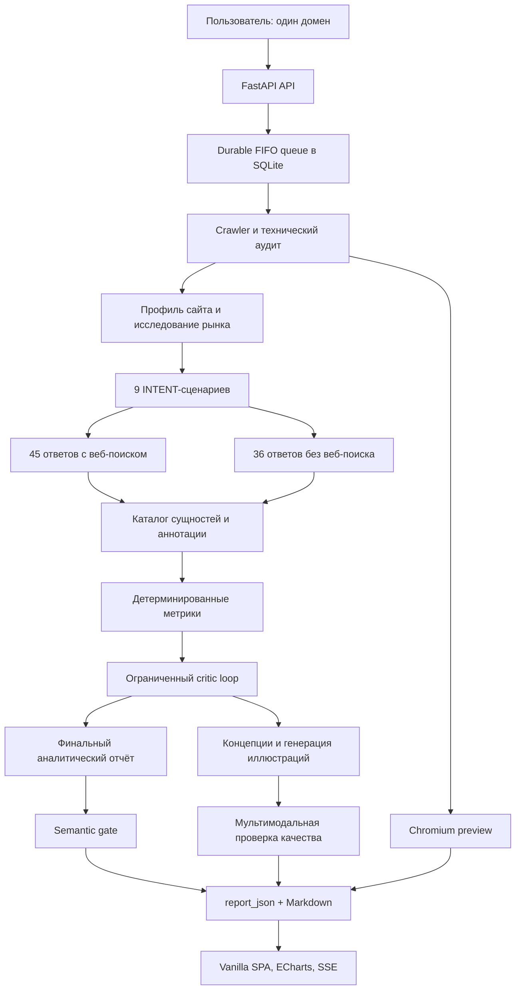

# AIV — руководство для разработчиков

AIV — публичный сервис RW+ для экспресс-исследования доступности сайта и бренда в ИИ-поиске. Пользователь указывает один домен, после чего сервис:

1. проверяет, какой HTML и какие правила сайт отдаёт поисковым и ИИ-краулерам;
2. определяет бренд, продукты, аудиторию, рынок и реальные задачи выбора;
3. моделирует девять пользовательских сценариев;
4. получает ответы пяти семейств ИИ-систем с веб-поиском и четырёх семейств без него;
5. детерминированно считает метрики по сохранённым ответам;
6. пропускает расчёты и текст через ограниченные циклы критики;
7. публикует интерактивный отчёт, реальные данные и иллюстрации.

Этот документ рассчитан на разработчиков, которые будут ревьювить код, искать узкие места, менять методологию, ускорять пайплайн и поддерживать production. Он описывает текущую реализацию, а не желаемую архитектуру.

> **Главные инварианты проекта**
>
> - Сырые ответы модельной панели — исходные доказательства. Завершённый непустой ответ нельзя незаметно переписать.
> - Метрики считает код, а не финальная LLM.
> - `unknown` и `unavailable` не превращаются в ноль и не попадают в знаменатель.
> - Режим «с вебом» или «без веба» учитывается только после проверки фактической транспортной телеметрии.
> - Повторный анализ существующей проверки не должен повторно собирать исходные ответы панели.
> - Публичный отчёт не должен публиковаться, если критик, provenance-проверка или semantic gate нашли неустранённое противоречие.

## Содержание

- [Быстрый запуск](#быстрый-запуск)
- [Архитектура](#архитектура)
- [Как проходит одна проверка](#как-проходит-одна-проверка)
- [Модельная панель и математика 81 ответа](#модельная-панель-и-математика-81-ответа)
- [Как считаются метрики](#как-считаются-метрики)
- [Хранение данных и checkpoints](#хранение-данных-и-checkpoints)
- [Очередь, восстановление и SSE](#очередь-восстановление-и-sse)
- [API](#api)
- [Фронтенд](#фронтенд)
- [Конфигурация](#конфигурация)
- [Тестирование](#тестирование)
- [Пересчёт сохранённых проверок](#пересчёт-сохранённых-проверок)
- [Production и безопасный деплой](#production-и-безопасный-деплой)
- [Как безопасно развивать проект](#как-безопасно-развивать-проект)
- [Безопасность](#безопасность)
- [Известные ограничения](#известные-ограничения)
- [Термины](#термины)

## Быстрый запуск

Требования:

- Python 3.12 или новее;
- [`uv`](https://docs.astral.sh/uv/);
- Node.js для двух frontend runtime test fixtures;
- ключ OpenRouter для реального аналитического запуска;
- Chromium для локального захвата первого экрана сайта.

Из корня проекта:

```bash
uv sync
cp .env.example .env
uv run playwright install chromium
uv run uvicorn app.main:app --host 0.0.0.0 --port 8000
```

В `.env` нужно как минимум заполнить:

```dotenv
OPENROUTER_API_KEY=...
```

Интерфейс откроется на `http://localhost:8000`. Проверка состояния:

```bash
curl -fsS http://127.0.0.1:8000/api/healthz
```

Приложение следует запускать именно из корня репозитория: `.env` читается относительно текущей рабочей директории. SQLite всегда находится по пути `<project>/sqlite.db`.

> **Осторожно с production-копией БД.** Запуск приложения вызывает `init_db()`: создаёт недостающие таблицы и колонки, чинит некоторые состояния очереди и может перевести незавершённые проверки в восстановление. Обычный импорт и старт приложения на копии production DB нельзя считать строго read-only операцией.

## Архитектура



### Технологический стек

- **Backend:** FastAPI, Uvicorn, Python 3.12+.
- **Хранилище:** SQLAlchemy 2 async, SQLite, `aiosqlite`.
- **Сетевой аудит:** `httpx`, Beautiful Soup, собственные SSRF- и redirect-проверки.
- **Скриншот:** Playwright/Chromium, в production — изолированный systemd worker.
- **LLM и изображения:** OpenRouter.
- **Frontend:** один server-rendered shell с vanilla HTML/CSS/JavaScript, без обязательной сборки.
- **Графики:** ECharts с SVG renderer.
- **Анимация:** GSAP.
- **Markdown:** локальная копия Marked.
- **Live progress:** Server-Sent Events через `StreamingResponse`.

### Карта репозитория

```text
app/
├── config.py                  переменные окружения и значения по умолчанию
├── db.py                      engine, SQLite pragmas, bootstrap-миграции
├── main.py                    ASGI app и lifespan
├── models.py                  SQLAlchemy-модели
├── schemas.py                 публичные Pydantic-контракты
├── routes/
│   ├── pages.py               SPA-маршруты и UI build id
│   ├── runs.py                создание, история, retry, share и SSE
│   └── shared.py              получение отчёта по share token
└── services/
    ├── crawler.py             discovery, probes, технический аудит
    ├── content_extractor.py   извлечение текста и признаков рендеринга
    ├── protections.py         WAF, captcha, auth, geo и shell detection
    ├── robots_parser.py       разбор robots.txt
    ├── proxy_pool.py          необязательный Webshare proxy pool
    ├── site_preview*.py       Chromium preview и worker
    ├── analyzer.py            основной аналитический пайплайн
    ├── openrouter.py          OpenRouter transport и web attestation
    ├── analysis_critic.py     критик сущностей и расчётов
    ├── report_semantic_gate.py semantic gate финального текста
    ├── run_coordinator.py     durable FIFO queue и lease
    ├── run_lease.py           защита от записи устаревшим worker
    ├── progress.py            стадии и terminal transitions
    └── event_bus.py           недолговечный SSE pub/sub

static/
├── index.html                 весь SPA: разметка, стили, state и renderer
├── brand/                     логотипы и версионируемые UI-ассеты
├── generated/<run-id>/        runtime preview и иллюстрации отчётов
└── vendor/                    локальные browser-зависимости

scripts/                       операторские rebuild и preview-команды
tests/                         unittest и adversarial regression tests
docs/                          продуктовые и дизайн-заметки
```

Основная сложность сосредоточена в [`app/services/analyzer.py`](app/services/analyzer.py). Это намеренно единый оркестратор, но при дальнейшем росте его стоит делить по границам домена: site intelligence, panel collection, entity resolution, metrics, report synthesis и visuals.

## Как проходит одна проверка

### 1. Создание и постановка в очередь

`POST /api/runs` принимает только `{"domain": "example.com"}`. Любые скрытые настройки краулера или моделей отклоняются Pydantic-схемой.

`normalize_domain()`:

- принимает домен или обычный HTTP(S)-URL;
- приводит hostname к нормальной форме;
- отбрасывает некорректные значения;
- перед сетевым запросом требует публичный DNS/IP;
- запрещает credentials в URL и порты, кроме 80/443.

Если для того же домена уже есть активная проверка, API возвращает её `run_id`, а не создаёт дубликат. Новая запись получает статус `pending` и попадает в общую FIFO-очередь. По умолчанию в ожидании допускается не более 20 проверок.

### 2. Discovery и технический аудит

Координатор резервирует единственный глобальный execution slot и вызывает `run_crawl()`.

Crawler:

1. читает главную страницу с контрольным браузерным user-agent;
2. извлекает ссылки из HTML и `/sitemap.xml`;
3. выбирает репрезентативные страницы — обычно до 6, жёсткий runtime cap равен 8;
4. сохраняет выбор в versioned artifact `site_page_manifest`;
5. проверяет выбранные страницы с десятью идентичностями:
   - `GPTBot`;
   - `OAI-SearchBot`;
   - `ChatGPT-User`;
   - `ClaudeBot`;
   - `PerplexityBot`;
   - `Perplexity-User`;
   - `Googlebot-desktop`;
   - `Google-Agent-desktop`;
   - `DeepSeekBot`;
   - `Chrome-control`;
6. отдельно читает и разбирает `robots.txt`;
7. сохраняет HTTP status, TLS, redirects, latency, безопасную часть заголовков, признаки защит, доступный текст и признаки рендеринга.

`DeepSeekBot` здесь — диагностический observed token. Он не доказывает поведение официального production crawler DeepSeek.

`content_extractor.py` различает:

- статический или server-rendered HTML;
- hybrid rendering;
- пустую CSR-оболочку;
- содержательную страницу с формой входа;
- Schema.org-типы и полноту извлечения.

Если ответ усечён, отсутствие текста, schema или признаков рендеринга становится `unknown`, а не отрицательным фактом. Защиты Cloudflare, Qrator, DDoS-Guard, Variti, Akamai, Imperva, DataDome, captcha, geo-wall и auth-wall классифицируются отдельно.

Запуски сетевых запросов к одному домену разделены минимум 0,65 секунды. `DEFAULT_CONCURRENCY` ограничивает внутреннюю параллельность, но не отменяет per-domain rate limit.

### 3. Реальный первый экран сайта

Параллельно с техническими probes запускается `capture_site_preview()`:

- viewport: 1440×900;
- результат: `static/generated/<run-id>/site-preview-<hash>.jpg`;
- запись на диск атомарная;
- метаданные сохраняются как artifact `site_preview`;
- каждый URL и redirect повторно проверяется на выход в приватную сеть;
- ошибка preview не прерывает исследование.

Скриншот нужен только как визуальный контекст hero-блока отчёта. Он не влияет на технический score. Если preview недоступен, UI использует `static/brand/generated/aiv-report-cover.webp`.

### 4. Техническая и смысловая основа

`_prepare_analysis_foundation()` выполняет независимую работу параллельно:

- `_technical_summary()` и `_site_context()`;
- после этого `_review_technical_summary()` и `_classify_site()`.

Технические числа остаются программными. LLM-ревьюер только объясняет их и проверяет, что вывод не смешивает robots, WAF, CSR, auth и неизвестность.

Профиль сайта содержит подтверждённые:

- основной бренд и алиасы;
- тип сайта и категорию;
- продукты и услуги;
- аудитории и customer jobs;
- критерии выбора;
- рынок, географию и позиционирование;
- связи между сущностями и уровень уверенности.

### 5. Исследование рынка до генерации сценариев

`_market_research()` обращается к сильной аналитической модели с обязательным веб-поиском. В контекст входят указанный пользователем сайт, извлечённые страницы и профиль.

Модель должна разделить:

- `site_confirmed` — факты, подтверждённые сайтом;
- `external_market_research` — рынок, аудитории, customer jobs, критерии выбора и терминологию из внешних источников.

Gate требует подтверждённый web transport, URL-citations, достаточное покрытие измерений и как минимум два независимых внешних источника. Внешний поиск не может переопределить основной бренд, если это противоречит сайту.

### 6. Девять пользовательских сценариев

`_generate_prompt_set()` создаёт ровно девять запросов:

- шесть безбрендовых discovery-запросов — по одному на каждый класс INTENT;
- три брендовых diagnostic-запроса.

Канонические INTENT-классы:

| Код | Смысл |
|---|---|
| `I` | Information Seeking — понять тему и получить общие сведения |
| `E` | Evaluative — сравнить варианты и критерии |
| `T` | Transactional — выбрать, заказать или принять решение |
| `NB` | Need Based — решить задачу, боль или ограничение |
| `NAV` | Navigation — найти источник, площадку или точку входа |
| `TR` | Trend-Driven — разобраться в тренде или меняющемся поведении |

Безбрендовый запрос не должен содержать бренд или его алиас и обязан просить назвать конкретные варианты. Брендовый запрос, наоборот, должен содержать подтверждённое имя.

Отдельный критик проверяет доминирующий INTENT и связь каждого сценария с market research. При несовпадении разрешена одна ограниченная переработка набора; бесконечного loop нет.

### 7. Сбор ответов модельной панели

После сохранения сценариев `_run_panel()` сначала собирает web-срез, затем memory-срез. Каждая ячейка хранит:

- точный сценарий и его роль;
- provider family и фактическую модель;
- запрошенный режим;
- raw response;
- citations и response annotations;
- usage;
- request hash;
- web-policy hash;
- результат transport attestation;
- status или provider error.

`_ensure_answer_rows()` не перезаписывает завершённый непустой raw answer. Есть одно осознанное исключение на более ранней границе: если изменился сам сохранённый текст сценария, `_persist_prompts()` удаляет связанные ответы и аннотации, потому что это уже другая измерительная ячейка. Поэтому изменение prompt-generation слоя может законно вызвать новый сбор панели; operator saved-answer reprocess этот слой не запускает.

Web-режим предлагает модели серверный OpenRouter web tool, а Perplexity — native Sonar search. Memory-режим явно выключает web plugin и запрещает tool calls. Одна только надпись `mode="memory"` ничего не доказывает: ответ войдёт в метрики только после проверки телеметрии.

Инструмент именно **предлагается**, а не навязывается через `tool_choice: "required"`. Принудительный `tool_choice` действует на каждом витке серверного цикла инструментов, поэтому модель не получает хода на текст: Anthropic закрывает обмен с `native_finish_reason="pause_turn"` и пустым `content`. Именно это с 1 по 21 августа 2026 валило каждый прогон на шаге `market_research`. Гарантию даёт не запрос, а `attest_web_response()`: она сверяет `usage.server_tool_use_details.web_search_requests` и `url_citation`-аннотации уже по ответу, а при нарушении контракта `chat()` повторяет запрос, явно сообщив модели причину отказа.

Отдельная тонкость: наличие `url_citation` зависит от upstream-эндпоинта, а не от модели. Замер 2026-08-21 на `anthropic/claude-opus-5` с закреплением провайдера: Anthropic и Claude Platform on AWS — 0 аннотаций при `web_search_requests=3`, Amazon Bedrock и Azure — 11–12 аннотаций. Настройки `reasoning` на это не влияют. Поэтому `chat()` запоминает по модели эндпоинты, которые выполнили поиск, но не отдали цитат, и обходит их через `provider.ignore`. Память живёт в процессе и сбрасывается рестартом; маршрутизация намеренно не входит в policy hash.

### 8. Каталог сущностей и аннотация ответов

Из полного сохранённого корпуса строится entity catalog. Он отделяет:

- основной бренд;
- подтверждённые продукты и направления клиента;
- связанные бренды группы;
- конкурентов и внешние альтернативы;
- общие отраслевые термины.

Повторяемая атомарная разметка выполняется processing-моделью. Затем код сверяет её с raw text и entity policy. Общие слова вроде «programmatic» или «DOOH» не становятся продуктами клиента только потому, что встретились в ответе. Для портфельной видимости нужна конкретная сущность клиента либо явная связь услуги с клиентом.

Аннотация привязана к:

- SHA-256 исходного ответа;
- фактической модели ответа;
- SHA-256 входного каталога и правил;
- версии annotation prompt.

Несовпавшая или устаревшая аннотация не используется.

### 9. Детерминированные метрики и critic loop

`_compute_metrics()` считает проценты только по валидным строкам. После этого `_run_analysis_critic_loop()` получает сценарии, профиль, каталог, provenance, аннотации и рассчитанные метрики.

Критик может:

- выявить слишком широкую атрибуцию сущностей;
- сузить alias/entity policy;
- запросить повторную аннотацию и пересчёт.

Критик не может переписать raw answers или вручную назначить проценты. Максимум — два раунда. Первый `revise` запускает ограниченную корректировку; повторное возражение или `block` останавливает публикацию.

Первичный контекст критика содержит полный индекс корпуса с SHA, provenance и разметкой, но длинный raw-текст передаёт только для всех строк из детерминированных предупреждений и для воспроизводимой стратифицированной выборки по системе, режиму и роли сценария. Это уменьшает многомегабайтный запрос без потери строк из manifest. Включённый raw ограничен 24 000 символами; любое усечение помечается явно и закрывает gate. Основной critic-call использует medium reasoning и бюджет 20 000 output tokens. `finish_reason=length` и неразбираемый structured response считаются успешным HTTP transport, но не готовым решением: они не проходят gate и получают одну компактную repair-попытку с low reasoning и бюджетом 8 000 tokens. Repair получает digest полного payload, каталог, метрики, индекс корпуса и raw только затронутых ответов. После неудачного repair действует консервативный deterministic fallback.

### 10. Финальный отчёт и визуальная ветка

После critic gate запускаются две независимые ветки через `asyncio.TaskGroup`:

1. финальный аналитический отчёт;
2. концепции и генерация иллюстраций.

Финальная модель не получает произвольный обрезанный dump. `_full_answer_context()`:

- строит manifest всего critic-approved корпуса;
- проверяет ожидаемые prompt × provider × mode cells;
- связывает manifest с provenance критика;
- детерминированно выбирает до 12 наиболее информативных ответов;
- передаёт полный текст только для transport-eligible строк;
- оставляет ineligible-строки в виде metadata-only;
- доказывает покрытие наблюдаемых evidence strata;
- fail-closed останавливается при несовпадении digest или превышении token budget.

Структурный кандидат отчёта может получить одну repair-попытку. После этого отдельный semantic gate проверяет causal claims, режимы, недоступные срезы, числа и ограничения; для semantic repair предусмотрено не более двух итераций.

Визуальная ветка:

- получает те же вычисленные факты и релевантный контекст клиента;
- создаёт три самостоятельные концепции;
- генерирует изображения через image model;
- проверяет каждое изображение мультимодальной processing-моделью;
- при проблемах усиливает prompt и повторяет генерацию;
- допускает не более трёх кандидатов на иллюстрацию;
- обрабатывает роли с ограниченной параллельностью 2.

Ошибка всей визуальной ветки не должна уничтожать корректный аналитический отчёт.

## Модельная панель и математика 81 ответа

Текущая конфигурация панели:

| Семейство | Web | Memory | Переменная модели |
|---|:---:|:---:|---|
| ChatGPT | да | да | `OPENROUTER_OPENAI_MODEL` |
| Gemini | да | да | `OPENROUTER_GEMINI_MODEL` |
| Perplexity | да | нет | `OPENROUTER_PERPLEXITY_MODEL` |
| DeepSeek | да | да | `OPENROUTER_DEEPSEEK_MODEL` |
| Claude | да | да | `OPENROUTER_CLAUDE_MODEL` |

Для каждого нового запуска есть 9 сценариев:

```text
web:    9 × 5 = 45 ячеек
memory: 9 × 4 = 36 ячеек
итого:       = 81 ячейка
```

Perplexity не входит в memory-срез, потому что текущий поисковый продукт панели не даёт честного offline-режима.

81 — это размер ожидаемой матрицы, а не обещание 81 пригодного ответа. Провайдер может вернуть ошибку, пустой текст или ответ с нарушенной web policy. Порог 60% внутри `_run_panel()` — лишь ранняя операционная проверка. Перед публикацией full-corpus manifest требует все ожидаемые ячейки без пропусков и дублей, с завершённым непустым raw answer и актуальной аннотацией. Transport eligibility затем определяет, может ли строка войти в метрики и в полнотекстовый контекст; неподтверждённый новый режим не превращается в измерение.

Если отдельный ответ обрывается только из-за лимита вывода, panel делает ровно один адресный повтор этой же ячейки: `3 200 → 6 400` токенов. Повтор не распространяется на другие ошибки и не пересобирает уже завершённые строки. Provenance хранит хеш, длину, transport-флаги и token usage обеих попыток; при втором обрыве частичный ответ остаётся в `failed`-строке для аудита, но не входит в метрики. Разрешённые лимиты зафиксированы allowlist, поэтому подмена бюджета нарушает request hash и закрывает строку fail-closed.

При добавлении или удалении семейства нужно одновременно изменить:

1. `app/config.py` и `.env.example`;
2. `panel_models()` в `app/services/openrouter.py`;
3. web/memory policy;
4. expected-cell manifest;
5. provider logo и frontend labels;
6. тесты матрицы, attestation, метрик и отчёта.

## Как считаются метрики

### Базовые правила знаменателя

Строка входит в расчёт, только если:

- panel request завершён;
- raw text непустой;
- фактический режим подтверждён transport attestation;
- аннотация существует и совпадает с raw-answer/model/input hashes;
- аннотация помечена как валидная.

Отсутствующая, failed, stale или unattested строка не считается нулём — она исключается и отражается в `data_state`, coverage и limitations.

### Безбрендовая видимость

Для шести `unbranded_discovery` сценариев отдельно считаются:

- `mention_rate` — доля валидных ответов, где система сама назвала цель;
- `top3_rate` — доля валидных ответов, где цель вошла в первые три позиции;
- `recommendation_rate` — доля валидных ответов с прямой рекомендацией;
- `conditional_rate` — доля условных рекомендаций;
- `score` — составной индекс:

```text
score = 0,25 × mention_rate
      + 0,35 × top3_rate
      + 0,40 × recommendation_rate
```

Score — внутренний индекс видимости, а не вероятность, не market share и не процент пользователей.

### Parent brand и portfolio

`parent_discovery` отвечает на вопрос: назвали ли основной бренд без подсказки.

`portfolio_visibility` отвечает на вопрос: назвали ли подтверждённые продукты, направления или связанные бренды клиента. Здесь действует более строгая attribution policy. Само совпадение с тематикой запроса не считается продуктовой видимостью.

Если профиль не подтверждает состав портфеля, весь portfolio-срез становится `unavailable`, а не `0%`.

### Brand knowledge

`brand_knowledge` строится по трём `brand_diagnostic` сценариям, где бренд уже назван в вопросе. Этот срез нельзя смешивать с безбрендовым discovery: он измеряет качество ответа о названном бренде, а не способность самостоятельно его обнаружить.

### Технический score

Технический score — взвешенный индекс нескольких измеренных сигналов на проверенных страницах. Он не является «процентом доступа сайта» и не доказывает реальную индексацию конкретной ИИ-системой.

Скриншот Chromium не влияет на score. Основной технический источник — исходный server HTML и HTTP-поведение для разных user-agent identities.

### Evidence states

Актуальные строки могут иметь состояния:

- `attested` — режим подтверждён текущим контрактом;
- `legacy_retrieval_confirmed` — старый web-запуск с достаточным подтверждением;
- `legacy_observational` — исторический memory-срез без строгого доказательства запрета web;
- `mixed` — в одном aggregate смешаны разные классы доказательств;
- `unavailable` — пригодных данных нет.

Legacy observational данные можно показывать только с явным ограничением; их нельзя интерпретировать как чистый причинный эффект отключения веб-поиска.

## Хранение данных и checkpoints

### SQLite

База находится в `sqlite.db`. При соединении включаются:

```text
PRAGMA foreign_keys=ON
PRAGMA busy_timeout=10000
PRAGMA journal_mode=WAL
PRAGMA synchronous=NORMAL
```

Полноценной системы миграций вроде Alembic пока нет. `init_db()` вызывает `create_all()` и набор best-effort `ALTER TABLE`. Большинство ошибок добавления старых колонок проглатывается; наличие уникального execution-slot index проверяется строго.

Для следующего серьёзного изменения схемы рекомендуется сначала внедрить нормальные нумерованные миграции. До этого каждую новую колонку нужно добавить и в SQLAlchemy-модель, и в bootstrap-миграцию, и проверить на копии старой БД.

### Таблицы

| Таблица | Назначение |
|---|---|
| `runs` | Корень проверки: очередь, lease, progress, итоговый Markdown/JSON, share token |
| `domain_probes` | HTTP/TLS/redirect/header/body/protection facts по URL и user-agent |
| `robots_rules` | Разобранные правила `robots.txt` |
| `site_pages` | Репрезентативные страницы и извлечённый контент |
| `run_artifacts` | Versioned checkpoint/cache промежуточных этапов |
| `visibility_prompts` | Девять сценариев проверки |
| `model_answers` | Сырые ответы модельной панели |
| `answer_annotations` | Нормализованная разметка, 1:1 с ответом |
| `report_illustrations` | Метаданные, prompt, model и file URL иллюстраций |

Все дочерние таблицы связаны с `runs` через `ON DELETE CASCADE`.

### Источники истины

Иерархия данных:

1. `model_answers.response_text`, citations и transport provenance — исходное модельное доказательство;
2. `answer_annotations` — производная, пересчитываемая разметка;
3. artifact `metrics` — детерминированный расчёт из текущих аннотаций;
4. `report_json` и `analysis_markdown` — публичное представление;
5. frontend charts — визуализация `report_json`, а не самостоятельный расчёт.

Если UI показывает число, которого нет в `report_json`, это frontend bug. Если `report_json` расходится с artifact `metrics`, это pipeline bug. Финальная LLM не должна быть источником новых процентов.

### `run_artifacts`

Artifact — mutable checkpoint по уникальному ключу `(run_id, artifact_key)`, а не append-only журнал всех попыток.

Кэш считается пригодным только при совпадении:

- `status == completed`;
- `prompt_version`;
- `model`, когда модель имеет значение;
- полного `input_json`;
- непустого `output_json`.

Основные группы artifacts:

- page manifest и site preview;
- site profile и technical review;
- market research;
- prompt set и prompt semantic review;
- entity catalog и annotation batches;
- metrics;
- critic rounds, policy и gate;
- full-corpus manifest, context selection и token preflight;
- final author candidate, semantic review и repair;
- illustration concepts, candidates и QA.

Версии слоёв находятся в верхней части `app/services/analyzer.py`, а версии критиков — в соответствующих модулях. Если изменился смысл prompt, schema, deterministic policy или входной контракт, нужно увеличить именно версию затронутого слоя. Иначе старый artifact может быть ошибочно принят за актуальный.

## Очередь, восстановление и SSE

### Машина состояний

Фактический enum:

```text
pending → crawling → analyzing → completed
                              ↘ failed
```

`recovering` — не значение `RunStatus`, а `stage_key`. Публичный `run_state` вычисляется как `queued`, `running`, `recovering`, `completed` или `failed`.

Шесть публичных stage keys:

- `site_discovery`;
- `technical_access`;
- `scenario_design`;
- `web_visibility`;
- `knowledge_gap`;
- `report`.

### Почему одновременно работает одна проверка

`EXECUTION_SLOT = 1`, а partial unique index разрешает только одну строку с непустым `execution_slot`. Claim старейшей queued-проверки выполняется в `BEGIN IMMEDIATE`.

Это глобальное ограничение на runs. `DEFAULT_CONCURRENCY` и `OPENROUTER_PANEL_CONCURRENCY` задают параллельность внутри одной проверки, а не число одновременных клиентов.

### Lease и восстановление

Claim хранит `lease_owner`, `lease_expires_at`, `heartbeat_at`, `attempt_count`, `resume_count` и `state_revision`. Heartbeat продлевает lease примерно раз в `max(5, lease_seconds / 3)` секунд.

`run_lease.py` связывает дочерние задачи с владельцем через `ContextVar`. Owner-aware UPDATE и `assert_run_lease()` не дают старому worker записать checkpoint или финальный отчёт после потери слота.

После рестарта или истечения lease проверка:

- возвращается в `pending`;
- получает `stage_key="recovering"`;
- сохраняет уже готовые raw answers, probes и artifacts;
- продолжает с совпадающих checkpoints.

### SSE

`event_bus.py` — in-memory транспорт, а не durable log. Он хранит до 500 последних событий на run и очищает завершённые каналы позднее.

`GET /api/runs/{id}/events` всегда сначала отдаёт authoritative snapshot из SQLite. `Last-Event-ID` имеет вид `<resume_count>:<sequence>`, поэтому cursor старой попытки не переносится на новый retry. Keepalive отправляется каждые 15 секунд.

После рестарта полный event history теряется, но актуальное состояние не теряется: его восстанавливает SQLite snapshot.

## API

FastAPI OpenAPI и интерактивная документация отключены. Публичные маршруты:

| Метод | Путь | Назначение |
|---|---|---|
| `GET` | `/` | Главная SPA |
| `GET` | `/history` | Публичная общая история |
| `GET` | `/r/{token}` | SPA для share-ссылки |
| `GET` | `/api/ui-version` | Текущий UI build id |
| `GET` | `/api/healthz` | Минимальный liveness check |
| `POST` | `/api/runs` | Создать проверку по одному домену |
| `GET` | `/api/runs` | Все проверки, новые сверху |
| `POST` | `/api/runs/lookup` | Получить до 8 переданных run IDs |
| `GET` | `/api/runs/{id}` | Progress или готовый публичный отчёт |
| `POST` | `/api/runs/{id}/retry` | Продолжить обычный pipeline |
| `POST` | `/api/runs/{id}/share` | Создать share token |
| `GET` | `/api/runs/{id}/events` | SSE progress stream |
| `GET` | `/api/shared/{token}` | Публичный report payload по token |

История полностью публичная и хранится на сервере. Она не привязана к `localStorage`, браузеру или авторизации. Share token — удобный стабильный URL, а не граница конфиденциальности.

Публичный `RunDetail` намеренно не включает:

- raw prompts;
- фактические model IDs;
- raw response bodies;
- proxy credentials или addresses;
- request headers;
- внутренние provider errors;
- служебные artifacts и critic payloads.

## Фронтенд

Весь клиент находится в [`static/index.html`](static/index.html). Сборщика и компонентного framework нет: один файл содержит HTML shell, CSS, state, маршрутизацию и render functions.

Клиентские экраны:

- `/` — форма новой проверки;
- `/?run=<uuid>` — progress или отчёт;
- `/history` — общая публичная история;
- `#history` — поддерживаемый legacy redirect;
- `/r/<token>` — shared report.

Поведение live run:

1. начальный `GET /api/runs/{id}`;
2. `EventSource('/api/runs/{id}/events')`;
3. резервный GET polling;
4. отклонение stale update по `state_revision`;
5. восстановление после смены `resume_count`.

История обновляется примерно раз в 10 секунд. UI build id проверяется раз в минуту и при возврате фокуса, чтобы открытая вкладка могла предложить обновление интерфейса.

Зависимости в браузере:

- Marked поставляется локально;
- GSAP и ECharts загружаются с jsDelivr с SRI;
- Manrope загружается из Google Fonts.

При отсутствии ECharts интерактивный график показывает контролируемое состояние ошибки, а числовые данные остаются доступны через табличный fallback. Графики используют SVG renderer, `ResizeObserver`, cleanup при rerender и учитывают `prefers-reduced-motion`.

Для старых `report_json` сохранена legacy-ветка renderer. При изменении schema нельзя просто удалить старые поля: сначала нужна миграция отчётов либо явная compatibility policy.

Брендовые ассеты и их происхождение описаны в [`static/brand/BRAND_NOTES.md`](static/brand/BRAND_NOTES.md). Источники provider marks — в [`static/brand/providers/THIRD_PARTY_ASSETS.md`](static/brand/providers/THIRD_PARTY_ASSETS.md).

Различайте:

- `static/brand/generated/` — версионируемые UI-ассеты, деплоятся с кодом;
- `static/generated/` — runtime-файлы конкретных проверок, не должны удаляться при code deploy.

## Конфигурация

Все настройки объявлены в [`app/config.py`](app/config.py), образец — [`.env.example`](.env.example).

### OpenRouter и модели

| Переменная | Значение по умолчанию | Роль |
|---|---|---|
| `OPENROUTER_API_KEY` | пусто | Обязательный секрет для реальных вызовов |
| `OPENROUTER_MODEL` | `anthropic/claude-opus-5` | Общий fallback |
| `OPENROUTER_ANALYSIS_MODEL` | `anthropic/claude-opus-5` | Сильная аналитика и финальный автор |
| `OPENROUTER_PROCESSING_MODEL` | `openai/gpt-5.6-terra` | Каталог, аннотации, QA; high reasoning задаёт код |
| `OPENROUTER_CRITIC_MODEL` | `google/gemini-3.6-flash` | Prompt critic, analysis critic, semantic gate |
| `OPENROUTER_ORCHESTRATOR_MODEL` | `anthropic/claude-fable-5` | Дорогой planner только для исключительного восстановления |
| `PIPELINE_ORCHESTRATOR_ENABLED` | `false` | Опционально разрешает bounded recovery после исчерпания обычного контура; включается явно после канарейки |
| `PIPELINE_ORCHESTRATOR_MAX_CALLS_PER_RUN` | `2` | Жёсткий лимит planner-вызовов на одну проверку |
| `PIPELINE_ORCHESTRATOR_MAX_INPUT_CHARS` | `80000` | Верхняя граница сериализованного planner-контекста |
| `OPENROUTER_ILLUSTRATION_CONCEPT_MODEL` | `anthropic/claude-opus-5` | Art direction |
| `OPENROUTER_IMAGE_MODEL` | `google/gemini-3-pro-image` | Генерация изображений |
| `OPENROUTER_OPENAI_MODEL` | `openai/gpt-chat-latest` | ChatGPT family в панели |
| `OPENROUTER_GEMINI_MODEL` | `google/gemini-3.6-flash` | Gemini family в панели |
| `OPENROUTER_PERPLEXITY_MODEL` | `perplexity/sonar-pro-search` | Perplexity family в панели |
| `OPENROUTER_DEEPSEEK_MODEL` | `deepseek/deepseek-v4-pro` | DeepSeek family в панели |
| `OPENROUTER_CLAUDE_MODEL` | `anthropic/claude-sonnet-5` | Claude family в панели |
| `OPENROUTER_TIMEOUT_SECONDS` | `180` | Таймаут одного вызова |
| `OPENROUTER_PANEL_CONCURRENCY` | `5` | Параллельность panel cells внутри run |
| `FINAL_INPUT_TOKEN_BUDGET` | `160000` | Бюджет user payload финального автора |

Модель и версия prompt сохраняются вместе с artifacts. Простая замена default model не должна молча переиспользовать результат другой модели.

Recovery-orchestrator не участвует в штатном happy path. После исчерпания локальных repair-попыток он получает сжатый incident, факты, digest и короткий allowlist действий. Модель не исполняет код, не меняет raw-ответы, SQL или метрики. Решение проходит кодовую проверку области, сохраняется в append-only `recovery_epochs`, исполняется фиксированным обработчиком и закрывается сравнением before/after digest. Одинаковое действие для того же fingerprint второй раз запрещено. `acceptance_checks` — не свободный текст модели, а enum исполняемых кодом проверок: например, контракт сценариев, semantic review, неизменность raw-корпуса и повторный critic gate. Потерявший lease воркер не может сохранить или завершить recovery epoch; повторное исполнение одного плана также ограничено отдельным бюджетом.

Первый production rollout подключает этот контур только к `scenario_design`: после четырёх обычных итераций planner может назначить одну последнюю guided-попытку, проверенный детерминированный fallback или безопасную остановку с checkpoint. В `knowledge_gap` Fable пока не имеет права обходить независимый critic gate и публиковать ограниченный отчёт: сохранённые ответы переанализируются обычным детерминированным контуром. Post-critic recovery следует добавлять отдельным rollout с повторной проверкой неизменности raw-корпуса и обязательным финальным critic verdict.

`chat()` сохраняет в `usage_json._aiv_transport` HTTP-статус, попытку, провайдера, фактическую модель, `finish_reason`, `native_finish_reason` и признак полноты output. Это только transport evidence: успешный HTTP-ответ или `finish_reason=stop` не означает, что critic verdict прошёл детерминированную проверку. Состояние critic до этой проверки записывается отдельно как `semantic_verdict_status=pending_deterministic_validation`.

### Сервис, crawler и очередь

| Переменная | Default | Назначение |
|---|---:|---|
| `HOST` | `0.0.0.0` | Bind host |
| `PORT` | `8000` | Bind port |
| `DEFAULT_CONCURRENCY` | `8` | Внутренняя параллельность crawler |
| `DEFAULT_TIMEOUT_SECONDS` | `20` | Таймаут HTTP probe |
| `AUDIT_PAGE_LIMIT` | `6` | Число репрезентативных страниц |
| `RUN_QUEUE_MAX_PENDING` | `20` | Максимум ожидающих runs |
| `RUN_LEASE_SECONDS` | `90` | Срок lease execution slot |
| `RUN_COORDINATOR_POLL_SECONDS` | `3` | Poll interval durable queue |
| `SITE_PREVIEW_WORKER_COMMAND` | пусто | Внешняя команда изолированного preview worker |

### Webshare proxy pool

Proxy pool необязателен. Без `WEBSHARE_API_KEY` crawler работает напрямую.

| Переменная | Default | Назначение |
|---|---:|---|
| `WEBSHARE_API_KEY` | пусто | Ключ Webshare |
| `PROXY_ENABLED` | `true` | Разрешить proxy transport при наличии ключа |
| `PROXY_REFRESH_INTERVAL_SECONDS` | `3600` | Обновление списка |
| `PROXY_FALLBACK_DIRECT` | `true` | Direct retry при transport failure proxy |
| `PROXY_COOLDOWN_SECONDS` | `300` | Карантин неработающего proxy |

`.proxy_cache.json` содержит runtime proxy data и может включать credentials. Файл исключён из Git и должен быть защищён как секрет.

## Тестирование

Полный suite:

```bash
uv run python -m unittest discover -s tests -v
```

На момент обновления этого README в suite 467 тестов.

Основные группы:

| Файлы | Что защищают |
|---|---|
| `test_pipeline_safety.py` | SSRF, API redaction, cache contracts, panel, metrics, corpus и report branches |
| `test_run_coordinator.py` | FIFO slot, lease, recovery, stale workers и SSE epochs |
| `test_openrouter_policy.py` | Web/memory request policy и attestation |
| `test_crawler_manifest.py`, `test_crawler_truncation.py` | Выбор страниц, reuse и unknown при truncation |
| `test_analysis_critic.py`, `test_critic_gate_adversarial.py` | Bounded critic loop и fail-closed policy |
| `test_report_semantic_gate.py`, `test_semantic_gate_stop_adversarial.py` | Семантическая проверка и остановка публикации |
| `test_entity_scope_adversarial.py`, `test_jois_attribution_adversarial.py`, `test_realweb_attribution_regressions.py` | Ложная атрибуция продуктов и владельцев |
| `test_reprocess_saved_run.py`, `test_rebuild_from_saved_annotations.py` | Raw integrity и rebuild-контракты |
| `test_site_preview.py` | Worker, SSRF-защита, кеш и runtime-файлы |
| `test_frontend_static.py` | Структура UI, доступность, charts, tooltips и отсутствие внутренних данных |
| `test_frontend_*_runtime.py` | Выполнение поставляемых JS-функций через Node.js |

Полезные точечные запуски:

```bash
uv run python -m unittest tests.test_openrouter_policy -v
uv run python -m unittest tests.test_run_coordinator -v
uv run python -m unittest tests.test_report_semantic_gate -v
uv run python -m unittest tests.test_reprocess_saved_run -v
uv run python -m unittest tests.test_frontend_static -v
```

Тесты используют общий путь `sqlite.db`, но создают и удаляют свои UUID-записи. Не запускайте их из production working directory.

## Пересчёт сохранённых проверок

### Безопасный полный переанализ без повторного panel

Основной операторский инструмент:

```bash
uv run python scripts/reprocess_saved_run.py <run-id>
```

Он:

- принимает только terminal run;
- отказывается работать при занятой общей очереди;
- занимает тот же durable execution slot;
- поддерживает lease heartbeat;
- ставит служебный marker saved-answers-only;
- делает count и SHA-256 snapshot всех `model_answers`;
- вызывает только `reprocess_saved_answers()`;
- не запускает crawl, market research, генерацию сценариев или model panel;
- повторно строит профиль, technical review, entity catalog, annotations, metrics, critic и narrative;
- не вызывает `_run_panel()` и не получает исходные ответы заново;
- после завершения проверяет неизменность raw-корпуса;
- при ошибке восстанавливает прежний terminal report и защищённый raw snapshot.

Downstream LLM-слои по-прежнему могут обращаться к OpenRouter и расходовать токены. «Без повторного panel» не означает полностью offline-пересчёт.

При таком переанализе bitmap-иллюстрации не генерируются заново. Могут обновиться текстовые visual concepts и подписи, а существующие файлы переиспользуются.

Для дополнительной защиты от одновременного запуска нескольких операторов в Linux:

```bash
flock -n /tmp/aiv-analysis-reprocess.lock \
  uv run python scripts/reprocess_saved_run.py <run-id>
```

Не используйте `POST /api/runs/{id}/retry` для этой задачи: retry возобновляет обычный pipeline, включая недостающие crawler/panel cells.

### Узкие сервисные скрипты

```bash
uv run python scripts/rebuild_from_saved_annotations.py <run-id>
uv run python scripts/rebuild_from_saved_annotations.py <run-id> --refresh-control-pages
uv run python scripts/rebuild_visuals.py <run-id>
uv run python scripts/backfill_site_preview.py <run-id>
```

- `rebuild_from_saved_annotations.py` переиспользует готовую разметку и требует совпадающий critic provenance. Он заново запускает финальную report/visual ветку и может расходовать токены. У него нет полного lease/rollback/raw-integrity контракта основного reprocess script.
- `--refresh-control-pages` делает новые сетевые запросы к контрольным HTML-страницам.
- `rebuild_visuals.py` заново генерирует изображения из сохранённых концепций и напрямую обновляет `report_json`.
- `backfill_site_preview.py` захватывает реальный первый экран и напрямую добавляет его в отчёт.

Эти команды запускаются только вручную, при свободной очереди и после резервной копии.

## Production и безопасный деплой

В репозитории нет unit-файла основного FastAPI-сервиса. Текущий production использует внешний `ai-visibility.service` и reverse proxy. Не считайте deploy воспроизводимым только по содержимому Git: systemd unit, reverse-proxy config и secrets управляются отдельно.

### Изолированный preview worker

На Linux установите worker один раз:

```bash
sudo scripts/install_site_preview_worker.sh
```

Затем задайте:

```dotenv
SITE_PREVIEW_WORKER_COMMAND=/usr/local/bin/aiv-site-preview
```

Wrapper запускает short-lived systemd unit от пользователя `aiv-preview` с private tmp/devices, read-only system, resource limits и блокировкой loopback, link-local и private сетей.

### Runtime state, который нельзя удалять

При code deploy сохраните:

- `.env`;
- `sqlite.db`, а при live-copy также согласованное WAL-состояние;
- `.proxy_cache.json`;
- `static/generated/`;
- установленный production unit;
- при необходимости `.venv/`, если deploy не пересобирает окружение атомарно.

Деплоить вместе с кодом нужно:

- `static/brand/`;
- `static/vendor/`;
- `static/index.html`;
- Python-код, scripts и lockfile.

Не являются production state:

- `output/`;
- локальные Playwright screenshots;
- image-generation QA dumps;
- `__pycache__/`.

Любой `rsync --delete` сначала запускайте с `--dry-run` и явными protect/exclude rules для runtime state.

### Проверка до и после рестарта

Перед рестартом:

1. проверьте, нет ли `pending`, `crawling` или `analyzing` run;
2. убедитесь, что не выполняется `reprocess_saved_run.py`;
3. сделайте SQLite-compatible backup;
4. проверьте, что новый код понимает старую schema и report JSON.

После рестарта:

```bash
systemctl status ai-visibility.service --no-pager
journalctl -u ai-visibility.service -n 200 --no-pager
curl -fsS http://127.0.0.1:8000/api/healthz
curl -fsS https://aiv.rw.plus/api/healthz
```

Затем откройте `/history` и минимум один готовый отчёт. Старт сервиса вызывает восстановление expired leases; остановленная проверка может автоматически продолжиться.

## Как безопасно развивать проект

### Матрица изменений

| Изменение | Основные места | Что обязательно проверить |
|---|---|---|
| Новое семейство панели | `config.py`, `openrouter.py`, `analyzer.py`, provider assets, frontend | 81-cell math, expected manifest, web/memory policy, labels, tests |
| Новый INTENT или число сценариев | `INTENT_DEFINITIONS`, prompt schema/validator/reviewer | Corpus math, charts, denominators, compatibility со старыми runs |
| Новое правило сущностей | entity catalog, reconciliation, critic policy | Версии catalog/annotation/metrics и adversarial regressions |
| Изменение формулы | `_compute_metrics()` и public report | `METRICS_VERSION`, semantic gate, UI tooltip, saved-run reprocess |
| Изменение report schema | final schema, `_build_public_report()`, frontend renderer | Legacy reports, semantic pointers, public API tests |
| Изменение иллюстраций | concepts, prompt, image QA, renderer | Отдельные версии concept/generation/QA и сохранённые assets |
| Новое поле БД | `models.py`, `db.py` | Upgrade старой SQLite DB и rollback strategy |
| Изменение UI | `static/index.html`, `pages.py` | `UI_BUILD_ID`, responsive/static/runtime tests |

### Правило версий

Увеличивайте версию того слоя, чья семантика изменилась:

- profile/market/prompt set;
- entity catalog;
- annotations;
- metrics;
- critic;
- final report;
- semantic gate;
- illustration concepts/generation/QA;
- site manifest или preview.

Не поднимайте один общий номер «на всякий случай»: это заставит повторить дорогие независимые этапы. Но и не оставляйте старую версию после изменения смысла — это опаснее, потому что создаёт ложный cache hit.

### Где искать ускорение без потери качества

Безопасные направления:

- распараллеливать только независимые ветки с уже определёнными входами;
- уменьшать повторные LLM-вызовы через точные artifact cache keys;
- батчить annotation work в пределах token и concurrency limits;
- хранить и анализировать `usage_json`, latency и retry reason по слоям;
- не запускать Chromium и генерацию изображений повторно без изменения входа;
- отделять deterministic filters от дорогого LLM judgment;
- переносить тяжёлую очередь с SQLite только вместе с эквивалентным lease/provenance контрактом;
- дробить монолитный frontend, сохраняя табличные fallbacks и compatibility renderer.

Опасные «оптимизации»:

- случайно семплировать panel rows до подсчёта метрик;
- выдавать failed/unknown за ноль;
- разрешить memory-строке войти без transport attestation;
- передавать финальному автору только агрегаты без связанных scenario + full-answer examples;
- повторно опрашивать panel при изменении только downstream-аналитики;
- снимать critic или semantic gate ради скорости;
- увеличивать число одновременно активных runs без изменения SQLite/lease design;
- деплоить с удалением `static/generated/` или production DB.

### Checklist для code review

- [ ] Изменение не переписывает завершённые raw panel answers.
- [ ] У нового derived artifact есть точный input/model/version contract.
- [ ] Unknown, unavailable и zero различаются во всех слоях.
- [ ] Все проценты выводятся из deterministic data, а не из narrative LLM.
- [ ] Web и memory подтверждены фактической телеметрией.
- [ ] Entity attribution требует явной связи с клиентом.
- [ ] Critic loop ограничен и fail-closed.
- [ ] Старый worker не может записать данные после потери lease.
- [ ] Public schema не раскрывает raw responses, headers, proxies или secrets.
- [ ] Report schema совместима со старыми сохранёнными отчётами.
- [ ] Runtime assets и SQLite переживут deploy.
- [ ] Добавлены regression tests, включая adversarial case.
- [ ] Полный unittest suite проходит.

## Безопасность

- Каждый hostname резолвится и проверяется на публичность до запроса.
- Каждый redirect проходит повторную проверку.
- Запрещены private, loopback, link-local и credentialed targets.
- Разрешены только HTTP(S) и порты 80/443.
- Чувствительные response headers не сохраняются в публичном payload.
- OpenRouter и Webshare credentials остаются на сервере.
- Preview worker в production запускается отдельно от приложения.
- Public schemas отделены от внутренних ORM-моделей.

Сервис намеренно публичный: все проверки и отчёты видны всем без авторизации. Сейчас в приложении нет полноценной аутентификации, пользовательских пространств и встроенного rate limiter. Ограничение очереди защищает вычислительный слот, но не заменяет rate limiting reverse proxy, контроль расходов и abuse monitoring.

## Известные ограничения

- Технический аудит наблюдает один сетевой vantage point. Geo/ASN/provider-network поведение может отличаться.
- Source HTML анализируется без выполнения JavaScript. Это осознанно для crawler accessibility; Chromium preview служит только визуальным контекстом.
- Выбирается ограниченный набор репрезентативных страниц, а не полный crawl сайта.
- AI visibility — снимок выбранных сценариев и текущих моделей, а не универсальный рейтинг рынка.
- Perplexity не участвует в строгом no-web срезе.
- Legacy memory rows могут быть только observational и не доказывают причинный эффект отключения веба.
- Очередь глобально однопоточная; SQLite подходит текущему масштабу, но ограничивает горизонтальное выполнение.
- `event_bus` недолговечен и не хранит полный event log после рестарта.
- Bootstrap-миграции SQLite пока не заменяют полноценную migration system.
- Frontend — большой монолитный файл; локальная правка легко затрагивает legacy и current renderer одновременно.
- GSAP, ECharts и Google Fonts зависят от внешних CDN/сервисов во время загрузки страницы.
- Production unit и reverse-proxy config не версионируются в этом репозитории.

## Термины

| Термин | Значение в проекте |
|---|---|
| **run** | Одна проверка одного домена |
| **panel** | Матрица пользовательских сценариев × ИИ-систем × режимов |
| **raw answer** | Неизменённый текст ответа модельной панели |
| **web** | Ответ с обязательным и подтверждённым retrieval |
| **memory** | Ответ с запрещённым и подтверждённо неиспользованным retrieval |
| **attestation** | Проверка фактической request/response телеметрии режима |
| **annotation** | Структурированная производная разметка raw answer |
| **artifact** | Версионируемый checkpoint/cache одного слоя |
| **parent brand** | Основной бренд анализируемого сайта |
| **portfolio** | Только подтверждённые продукты, направления и связанные бренды клиента |
| **critic gate** | Проверка сущностей, provenance и корректности расчётов до отчёта |
| **semantic gate** | Проверка смысловых утверждений финального текста |
| **lease** | Временное право worker записывать состояние run |
| **unknown** | Данных недостаточно для вывода |
| **zero** | Данные валидны, событие действительно ни разу не произошло |

Если код расходится с этим README, источником истины остаются тестируемые контракты в `app/services/`, модели БД и public schemas. Исправьте либо реализацию, либо этот документ в том же pull request — архитектурная документация не должна отставать от семантики пайплайна.
